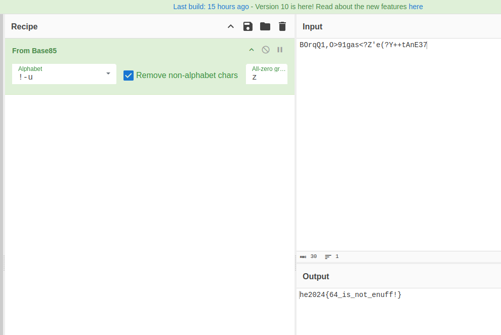

# Challenge "Teaser Challenge: Encoding Baseics"

I got this string, can you decode it?

    BOrqQ1,O>91gas<?Z'e(?Y++tAnE37

# Solution
I used [CyberChef](https://gchq.github.io/CyberChef/ "CyberChef on GitHub") and let auto detection solve the challenge (magic wand):

By doing so, the flag was revealed and we can see, that it was encoded Base85.

## The flag
    he2024{64_is_not_enuff!}