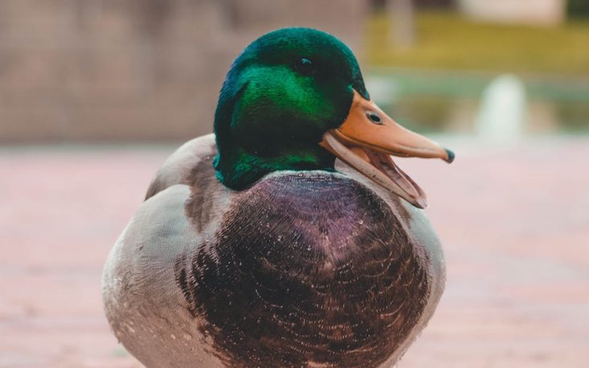
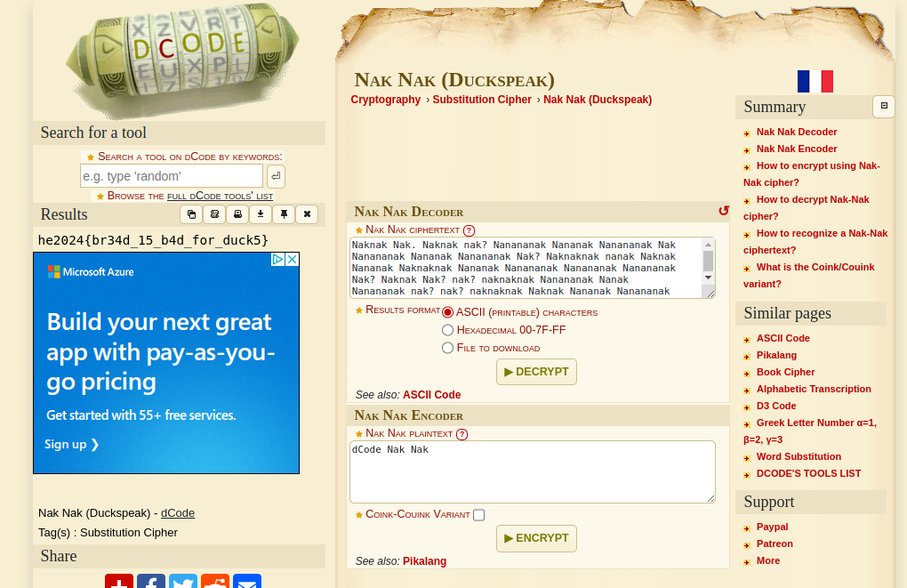

# Challenge "The Duck"

    Naknak Nak. Naknak nak? Nanananak Nananak Nanananak Nak Nanananak Nananak Nanananak Nak? Naknaknak nanak Naknak Nananak Naknaknak Nananak Nanananak Nanananak Nanananak Nak? Naknak Nak? nak? naknaknak Nanananak Nanak Nanananak nak? nak? naknaknak Naknak Nananak Nanananak Nak? Naknak Nak? nak? naknaknak Naknak Naknak Naknak naknaknak Naknaknak Nananak nak? naknaknak Naknak Nak? Naknaknak nak? Naknak Nanananak Naknak nanak Nanananak nak? Naknaknak nak!

# Solution
Using Google for "Naknak Duck" we receive an URL to https://www.dcode.fr/nak-nak-duckspeak and figure out, that there is an cipher for "Nak Nak (Duckspeak)". Entering the cipher there reveals the flag:

## The flag
    he2024{br34d_15_b4d_for_duck5}
