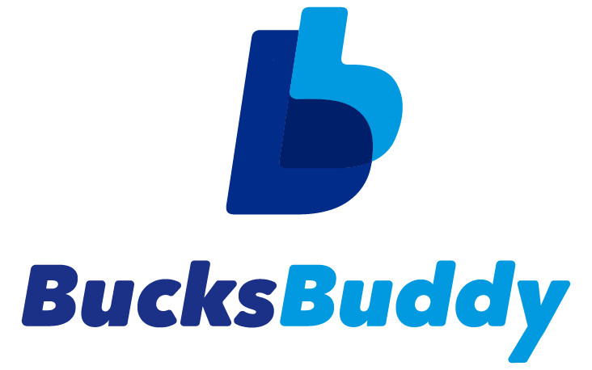
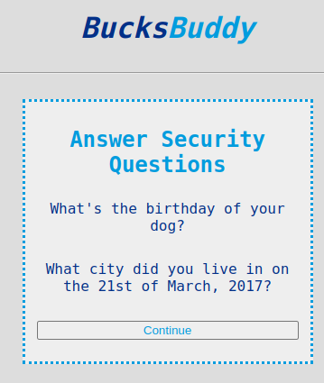
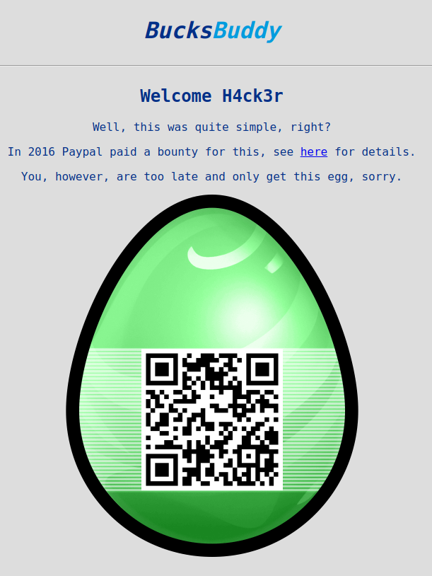

# Challenge "BucksBuddy"

You already know the username (joe) and his password (letmein1). But, what's next?

[BucksBuddy web site](http://ch.hackyeaster.com:2401/)

Note: The service is restarted every hour at x:00.

# Solution
This challenge is related to the Paypal Bug from 2016: https://henryhoggard.co.uk/blog/Paypal-2FA-Bypass

When opening http://ch.hackyeaster.com:2401/login, we can enter the credentials joe/letmein1.

Then we can use the link "Try another way" (http://ch.hackyeaster.com:2401/questions) to skip 2FA and using the "Security Question" form.

By deleting the two inputs as described on the official vulnerability, we can access the flag:

http://ch.hackyeaster.com:2401/bucksbuddy:

## The flag
    he2024{Not_that_easy_anymore, sigh!}
