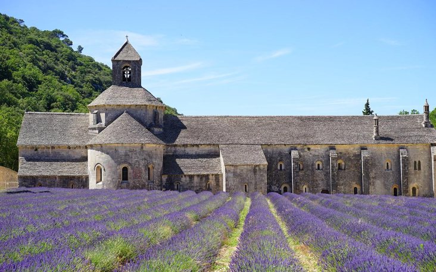

# Challenge "Monastery"

You found some strange symbol in an old monastery. Can you make any sense out of it?

Hint: After decoding the symbols, two more conversions are needed.

# Solution
By doing a Google picture reverse search it is getting clear, that we are talking about a "Cistercian numerals" cipher.

- Wikipedia article about that: https://en.wikipedia.org/wiki/Cistercian_numerals
- Guide about cipher: https://historysurvivalguide.com/cistercian-numerals/

    1 letter: 3
    2 letter: 9048
    3 letter: 9177
    4 letter: 8807
    5 letter: 
    6 letter: 
    7 letter: 
    8 letter: 
    10 letter: 
    11 letter: 
    12 letter: 
    13 letter: 

## The flag
    he2024{}
