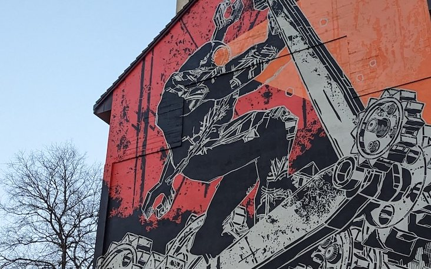

# Challenge "Street Art"

I found this great street art.

Find the name of the town!

🚩 Flag

- lowercase
- no spaces
- example: Los Angeles -> he2024{losangeles}

# Solution
Use Google Lens against image reveals a site https://dominikgehl.com, where images of this buildings are presented. The image is from Exomusée (https://exomusee.ch) and called "Les esclaves du temps" by "M-City".

It was created in "Le Locle" (Source https://exomusee.ch/m-city/).

## The flag
    he2024{lelocle}
