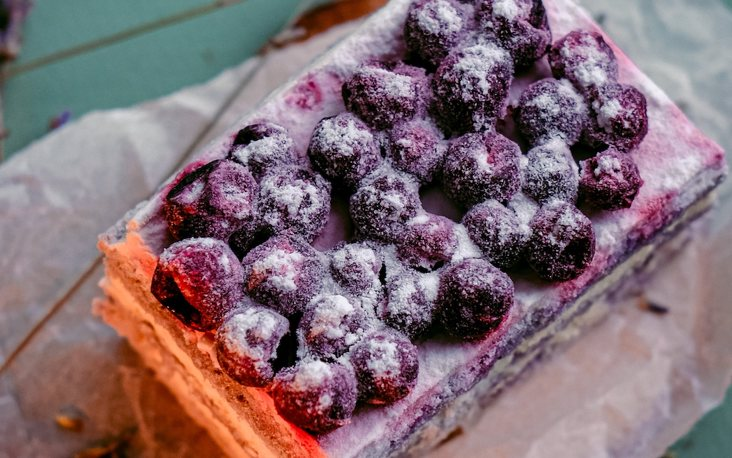

# Challenge "Piece of Cake 1"

Bunny Bob grinned from ear to ear, as he told the story of his new idea. "ROT. It's just ROT. Nothing more. But get this: Each letter is rotted individually, and I am using different numbers for each letter!".

Fred Rabbit wasn't impressed. "Hmm. Interesting. How do you communicate the needed individual rotations to the recipient?".
"Oh. That", Bob smiled. "You could say it's a piece of cake."

Here's the encoded flag:

    ii35;6^Ykf|h~j8adgf7ve5uuiw37wflaj}x`9rbgj|7† 

# Solution
Hint from Discord: Mar 14 -> Day of Pi!

We apply for each character a ROT (ROT47). Since we know it starts with "he2024{", we might identify a pattern:

    i -> 93 -> h
    i -> 90 -> e
    3 -> 93 -> 2
    5 -> 89 -> 0
    ; -> 85 -> 2
    6 -> 87 -> 4
    ^ -> 29 | 125 -> {
    Y
    k
    f
    |
    h
    ~
    j
    8
    a
    d
    g
    f
    7
    v
    e
    5
    u
    u
    i
    w
    3
    7
    w
    f
    l
    a
    j
    }
    x
    `
    9
    r
    b
    g
    j
    |
    7
    † -> 65 -> }

## The flag
    he2024{}
