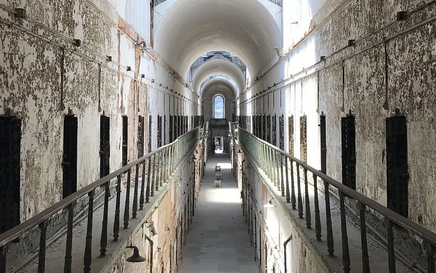
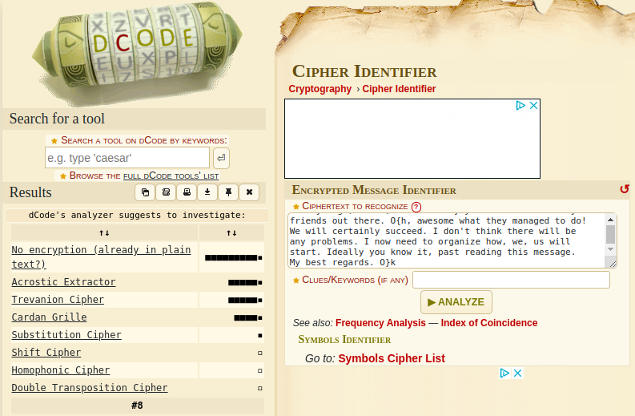

# Challenge "Prisoners"

Prison guards found a snippet of paper with a hand-written message:

    Hello! This message is for John. He is in block A, 12. 10 days ago, 12 am, 14th of July you asked me about my friends out there. O{h, awesome what they managed to do! We will certainly succeed. I don't think there will be any problems. I now need to organize how, we, us will start. Ideally you know it, past reading this message. My best regards. O}k

There seems to be a hidden message in there. Can you find it?

# Solution
By using cipher identification of DCode on https://www.dcode.fr/cipher-identifier, it will be revealed that several cipher algorithms could be possible:

After testing each, it is visible that "Trevanion Cipher" was used: https://www.dcode.fr/trevanion-cipher

With "[∅]+2" the flag is revealed:

## The flag
    he2024{wednesday}
