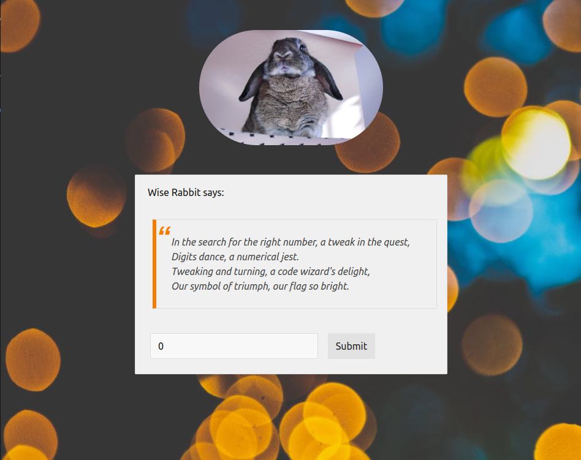
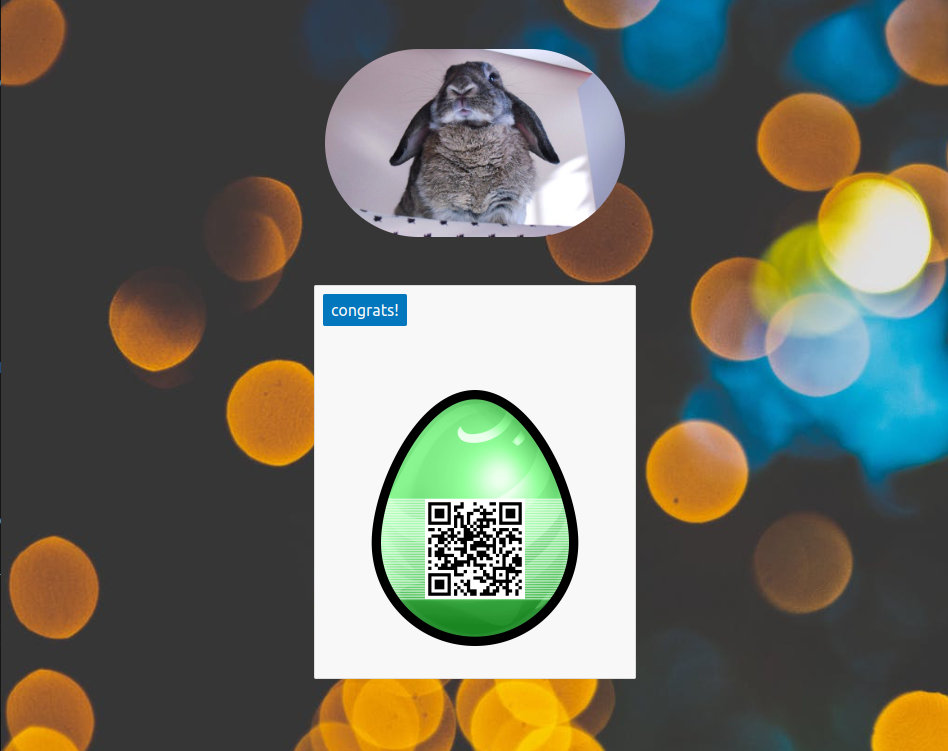

# Challenge "Wise Rabbit 3"

After a lengthy slumber spanning nine years, Wise Rabbit finally resurfaces on Hacky Easter!

    A simple number guessing,
    might be a little stressing,
    but with a simple tweak,
    you'll find the egg you seek.

[Wise Rabbit's Page](http://ch.hackyeaster.com:2405/)

Note: The service is restarted every hour at x:00.

[Web Page Source Code](wiserabbit3-source.txt)

    <html>
        <head>
        <link rel="stylesheet" href="https://cdn.rawgit.com/Chalarangelo/mini.css/v3.0.1/dist/mini-default.min.css">
        </head>
        <body style="padding: 50px; background-color: #ffffff; background-image: url('background.jpg'); background-size: cover;">
        

        </img>
        

          

    <?php
    require_once('egg.php');
    $code = $_GET['code'] ?? null;
    if (isset($code)) {
        echo('
');
        if (strpos($code, ".")) {
            echo('
<mark class="inline-block secondary">invalid character found!</mark>
');
        } else if (!is_numeric($code)) {
            echo('
<mark class="inline-block secondary">no number!</mark>
');
        } else if (strlen($code) <= 5) {
            echo('
<mark class="inline-block secondary">too short!</mark>
');
        } else if ($code < 13037) {
            echo('
<mark class="inline-block secondary">too small!</mark>
');
        } else if ($code > 13037) {
            echo('
<mark class="inline-block secondary">too big!</mark>
');
        } else{
            echo('
<mark class="inline-block">congrats!</mark>
 ');
        }
        echo('
');
    } else {
    ?>
    <form action="/" method="GET" style="width:480px; margin:0 auto; padding-left:20px;">
        Wise Rabbit says:  
        <blockquote>
        In the search for the right number, a tweak in the quest, 
        Digits dance, a numerical jest. 
        Tweaking and turning, a code wizard's delight, 
        </blockquote>
         
        <input type="number" name="code" placeholder="Code"></input>
        <input type="submit" value="Submit"></input>
    </form>
    <?php
    }
    ?>
    </body>
    </html>

# Solution
The web page provides an input field for a number:

The source code has an if/else condition tree, which checks for the following conditions:
- Code has to be provided
- Code does not have a point '.'
- Code has to be a number
- Code has to be at least 5 digits long
- A code lower than 13037 is invalid
- A code greater than 13037 is invalid

So the solution has to be 13037 because bigger and lower than that value is invalid. But we have to enter an input which is longer than 5 digits. And a workaround with decimal point is also not working.

So I used the submit URL and added just a plus (+) in the URL. With that, all conditions are met and the flag could be received:
http://ch.hackyeaster.com:2405/?code=13037+

## The flag
    he2024{p33_4g3_p33_c0d3_cr4ck3d!}
