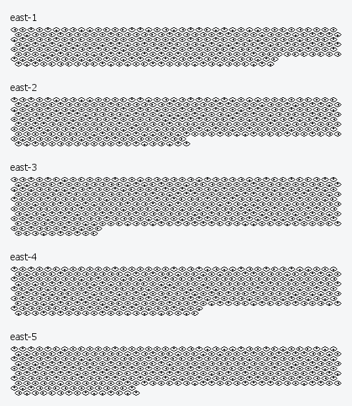
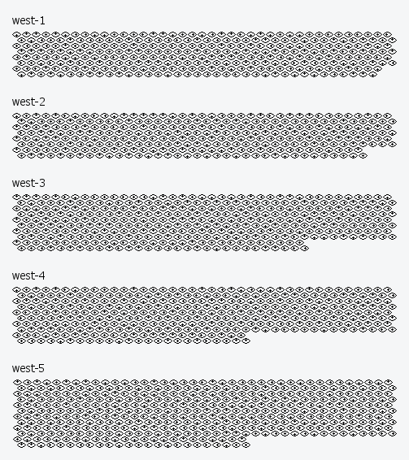

# Challenge "Eyes Reading"

The Easter Bunny has hidden a pair of eyes from the child named Noita. Maybe you can find out what he wanted to tell him with these messages?

🚩 Flag
- he2024{...}
- Don't forget to replace the brackets with { and } before entering the flag!

[eyes.zip](eyes.zip)

Hint: Start coding like Lymm!

# Solution
In the zip file we have two images:

Those seem to relate to the game "Noita":
- https://reddit.com/r/noita/comments/zmiaao/macbook_decoding_the_eye_cipher/?rdt=62174
- https://noita.fandom.com/wiki/Eye_Messages
- https://www.coursehero.com/file/226068863/Noita-Eye-Glyphs-Progress-pdf/
- https://scienceblogs.de/klausis-krypto-kolumne/2022/12/21/neues-zu-den-noita-kryptogrammen/
- https://puzzling.stackexchange.com/questions/119923/noita-eye-glyphs
- https://scienceblogs.de/klausis-krypto-kolumne/2022/12/21/neues-zu-den-noita-kryptogrammen/
- https://github.com/ngraham20/NoitaCryptographyResearch/tree/master
- https://docs.google.com/document/d/1s6gxrc1iLJ78iFfqC2d4qpB9_r_c5U5KwoHVYFFrjy0/edit
- https://docs.google.com/document/d/12sCi3OrTuy4PPcu3zUykue7suHvAPyK-uFKcm8Rp4Go/edit

After comparing all patterns with the game "Noita", we can conclude that only west-5 is added and the rest already existed in the game. So we focus to west-5 only:

The game-theory lets assume, that these eyes converts into number glyphs using the following table:

### Parsing the west-5 eyes
With the help of ChatGPT, I was able to generate a python code to split each symbol in their dedicated image. This was done with: 

[image_splitter.py](image_splitter.py)

After that, each output was stored in the folder "each_eye" with a reprensation of each type. Again with ChatGPT, I could generate another script which matches all symbols with their samples and outputs the correct view direction as string. This was done with:

[symbol_matcher.py](symbol_matcher.py)

After some adjustments in the script, the full cipher as text was extracted:

    t r t d c t d t c d c d r c t r d r r l t d c r c c r d c d c c r r d d r d t 
     c d c d l r r d r d l c d c d c c r d d c d r c c t r l c r c c d c c d c l r 
    r d d c c r c d c d t l r d d c c c d c d c c c r d r c l l c c d r l l c c l 
     l d r c c r t c c r d r c d r c d r d d r c t d c t d t d r c l c r d r c d r 
    r t l c c t c c c r d r r d c r l t c c r c d d d t c r l t r d t t c c r l l 
     r d r l c c c d t l t d l c c d l c c t r t c r r c c c c d c l r t c c r d r 
    c d t c d c r t l r t l c l d c c d r l t d c d d c l r d c r r c r r t r d r 
     d d c d l c l d r r d r t r r l l c d c d t r r c d r l t d d d r d l c l d r 
    d t l r c t c r c r c l d t t r d r r d c r d r r d r d c l c l l c c t r d c 
     r d r r r r l c c c d r c c d c d r l c c t t d c d r c d r d c c c d r l l r 
    c d r r d c r d r r d r d c d d c t c c d d c t 
     t t d l c c r l r l d r c l r d l r c l r d c c 

t = top
r = right
d = down
l = left
c = center

### Calculating the cipher
To implement the trigram cipher plus the transformations base5 to int, for each int + 32, and then to ASCII, I wrote another script:

[solver.py](solver.py)

The output was made visible to always be capable in crosschecking the result with the originl image:

    {1: ['trc', 'cdt', 'dcd', 'rlt', 'dtr', 'rdc', 'dcd', 'cld', 'rcd', 'dct', 'rdc', 'rcr', 'rld', 'cdt', 'dcd', 'crr', 'ccc', 'rtr', 'dcl', 'rcd', 'ccc', 'dcr', 'rdc', 'dcd', 'rdc', 'rlt'], 2: ['rdl', 'rdd', 'ccc', 'rcr', 'cdt', 'ccc', 'dtr', 'rdl', 'rdc', 'rdd', 'ccc', 'rdc', 'dcd', 'rdd', 'ccc', 'dtc', 'rdc', 'dtr', 'clt', 'rdl', 'ccc', 'cld', 'rlr', 'rdl', 'ccc', 'rdl'], 3: ['rtr', 'rdl', 'ccl', 'cct', 'ccc', 'tdc', 'rdl', 'dtr', 'rdl', 'ccc', 'rld', 'clt', 'ccc', 'rtr', 'cdt', 'rcd', 'dtr', 'ccc', 'rlc', 'dct', 'rdc', 'rlt', 'tct', 'ccc', 'rlr', 'rdl'], 4: ['cdd', 'cdt', 'cdd', 'clc', 'rtl', 'rdl', 'rtr', 'rdl', 'clt', 'rrd', 'ccl', 'cld', 'rld', 'dct', 'dct', 'rrd', 'dcc', 'rdl', 'rdl', 'dtc', 'rrd', 'rdc', 'rrd', 'clt', 'rdl', 'rdr'], 5: ['dtr', 'rdl', 'rcr', 'rrt', 'crl', 'ccc', 'rcc', 'rdl', 'dtc', 'dct', 'rdc', 'rdr', 'rdl', 'ccc', 'rdt', 'dtr', 'rdc', 'rdr', 'dcc', 'rdl', 'cld', 'ccl', 'ccc', 'rdt', 'rdl', 'rlc'], 6: ['cdt', 'dtr', 'rdl', 'ccc', 'rdr', 'rlr', 'rdl', 'rdr', 'dcc', 'rld', 'dcd', 'rlt', 'ccc', 'rld', 'dcd', 'cct']}

    {1: ['120', '031', '303', '241', '312', '230', '303', '043', '203', '301', '230', '202', '243', '031', '303', '022', '000', '212', '304', '203', '000', '302', '230', '303', '230', '241'], 2: ['234', '233', '000', '202', '031', '000', '312', '234', '230', '233', '000', '230', '303', '233', '000', '310', '230', '312', '041', '234', '000', '043', '242', '234', '000', '234'], 3: ['212', '234', '004', '001', '000', '130', '234', '312', '234', '000', '243', '041', '000', '212', '031', '203', '312', '000', '240', '301', '230', '241', '101', '000', '242', '234'], 4: ['033', '031', '033', '040', '214', '234', '212', '234', '041', '223', '004', '043', '243', '301', '301', '223', '300', '234', '234', '310', '223', '230', '223', '041', '234', '232'], 5: ['312', '234', '202', '221', '024', '000', '200', '234', '310', '301', '230', '232', '234', '000', '231', '312', '230', '232', '300', '234', '043', '004', '000', '231', '234', '240'], 6: ['031', '312', '234', '000', '232', '242', '234', '232', '300', '243', '303', '241', '000', '243', '303', '001']}

    [35, 16, 78, 71, 82, 65, 78, 23, 53, 76, 65, 52, 73, 16, 78, 12, 0, 57, 79, 53, 0, 77, 65, 78, 65, 71, 69, 68, 0, 52, 16, 0, 82, 69, 65, 68, 0, 65, 78, 68, 0, 80, 65, 82, 21, 69, 0, 23, 72, 69, 0, 69, 57, 69, 4, 1, 0, 40, 69, 82, 69, 0, 73, 21, 0, 57, 16, 53, 82, 0, 70, 76, 65, 71, 26, 0, 72, 69, 18, 16, 18, 20, 59, 69, 57, 69, 21, 63, 4, 23, 73, 76, 76, 63, 75, 69, 69, 80, 63, 65, 63, 21, 69, 67, 82, 69, 52, 61, 14, 0, 50, 69, 80, 76, 65, 67, 69, 0, 66, 82, 65, 67, 75, 69, 23, 4, 0, 66, 69, 70, 16, 82, 69, 0, 67, 72, 69, 67, 75, 73, 78, 71, 0, 73, 78, 1]

    C0ngran7UlaTi0n, YoU managed T0 read and par5e 7he eYe$! Here i5 Y0Ur flag: he2024[eYe5_$7ill_keep_a_5ecreT]. Replace bracke7$ bef0re checking in!

## The flag
    he2024{eYe5_$7ill_keep_a_5ecreT}
