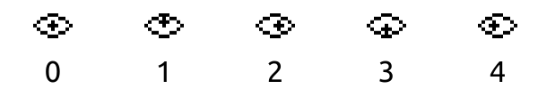

# Challenge "Eyes Reading"

The Easter Bunny has hidden a pair of eyes from the child named Noita. Maybe you can find out what he wanted to tell him with these messages?

🚩 Flag
- he2024{...}
- Don't forget to replace the brackets with { and } before entering the flag!

[eyes.zip](eyes.zip)

Hint: Start coding like Lymm!

# Solution
In the zip file we have tow images:

Those seem to relate to the game Noita:
- https://reddit.com/r/noita/comments/zmiaao/macbook_decoding_the_eye_cipher/?rdt=62174
- https://noita.fandom.com/wiki/Eye_Messages
- https://www.coursehero.com/file/226068863/Noita-Eye-Glyphs-Progress-pdf/
- https://scienceblogs.de/klausis-krypto-kolumne/2022/12/21/neues-zu-den-noita-kryptogrammen/
- https://puzzling.stackexchange.com/questions/119923/noita-eye-glyphs
- https://scienceblogs.de/klausis-krypto-kolumne/2022/12/21/neues-zu-den-noita-kryptogrammen/
- https://github.com/ngraham20/NoitaCryptographyResearch/tree/master
- https://docs.google.com/document/d/1s6gxrc1iLJ78iFfqC2d4qpB9_r_c5U5KwoHVYFFrjy0/edit

After comparing all patterns with the game Noita, we can conclud that only west-5 is added and the rest already existed in the game. So we focus to west-5 only:

The game converts these strings of numbers into eye glyphs using the following table:

### Parsing the west-5 eyes
With the help of ChatGPT, I was able to generate a python code to split each symbol in their dedicated image. This was done with: 

[image_splitter.py](image_splitter.py)

After that, each output was stored in the folder "each_eye" with a reprensation of each type. Again with ChatGPT, I could generate another script which matches all symbols with their samples and outputs the correct view direction as string. This was done with:

[symbol_matcher.py](symbol_matcher.py)

After some adjustments in the script, the full cipher as text was extracted:

    t r t d c t d t c d c d r c t r d r r l t d c r c c r d c d c c r r d d r d t 
     c d c d l r r d r d l c d c d c c r d d c d r c c t r l c r c c d c c d c l r 
    r d d c c r c d c d t l r d d c c c d c d c c c r d r c l l c c d r l l c c l 
     l d r c c r t c c r d r c d r c d r d d r c t d c t d t d r c l c r d r c d r 
    r t l c c t c c c r d r r d c r l t c c r c d d d t c r l t r d t t c c r l l 
     r d r l c c c d t l t d l c c d l c c t r t c r r c c c c d c l r t c c r d r 
    c d t c d c r t l r t l c l d c c d r l t d c d d c l r d c r r c r r t r d r 
     d d c d l c l d r r d r t r r l l c d c d t r r c d r l t d d d r d l c l d r 
    d t l r c t c r c r c l d t t r d r r d c r d r r d r d c l c l l c c t r d c 
     r d r r r r l c c c d r c c d c d r l c c t t d c d r c d r d c c c d r l l r 
    c d r r d c r d r r d r d c d d c t c c d d c t 
     t t d l c c r l r l d r c l r d l r c l r d c c 

t = top
r = right
d = down
l = left
c = center

### Calculating the cipher

## The flag
    he2024{}
