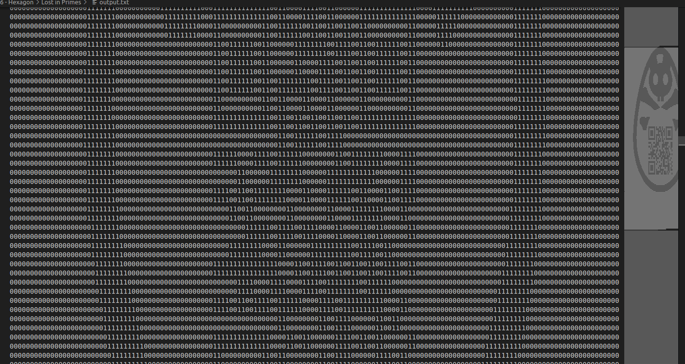
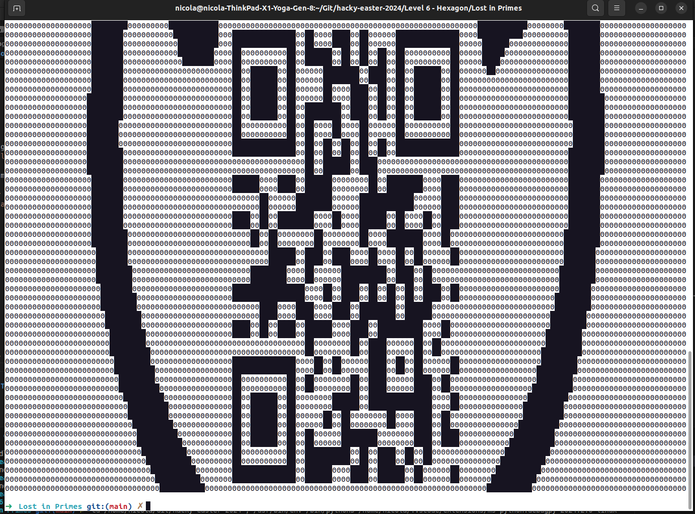

# Challenge "Lost in Primes"

One of our Prime eggs is lost.

It was last seen at [http://factordb.com/](factordb.com).

The only thing we know is that it has not yet been proven that it is really prime, and has more than 27000 digits.

🚩 Flag
- slightly different flag prefix this time, HE24!
- format: HE24{sample_flag}

Hint: Find a way to list / download numbers from the server, and search by what you can read and see here. Someone leaked parts of the number, check the download.

# Solution
From the leaked_part.png we can see that all visible numbers are 0 or 1. Furthermore, on Factordb we can see that the line length is exactly 120 characters long. With the search feature, we can generate a download URL to get primes from the DB:

    mindig = 27000
    perpage = integer
    start = integer
    download = 1 for true
    http://factordb.com/listtype.php?t=1&mindig={mindig}&perpage={perpage}&start={start}&download={download}

Because of the mentioned facts, we can generate a script to consume all primes with the above URL. But we have to make sure to consume them in small steps and that we filter for values which start with mostly 0 and 1. I assume we only have 0 and 1, but to left some space in my filter since we do not know for sure that only 0 and 1 exists in the number. Primes which matches the criteria will be stored in a output.txt:

[consumer.py](consumer.py)

    import requests

    def consume_factor_db_primes(min_digits,perpage):
        for start in range(0, 10000000, perpage):
            url = "http://factordb.com/listtype.php?t=1&mindig={0}&perpage={1}&start={2}&download=1".format(min_digits,perpage,start)
            response = requests.get(url) 
            response.raise_for_status()
            body = response.content.decode()
            numbers = body.split('\n')
            for number in numbers:
                if number[0:120].count('0') + number[0:120].count('1') > 100 and number[0:120].count('1') >= 8:
                    f = open("output.txt", "a")
                    f.write(number)
                    f.write("\n----------------------------------------------------------------------\n")
                    f.close()

    def main():
        consume_factor_db_primes(27000,500)

    if __name__ == "__main__":
        main()

By going through the output.txt in VSCode, the flag instantly gets visible (maybe this was luck to see...):

To make it better for scanning, I exported the QR of the flag to [flag_qr_only.txt](flag_qr_only.txt) which can be parsed easly.

For parsing, I made this script which replaces '1' with '█':

[flag_generator.py](flag_generator.py)

    def display_flag_from_qr_text():
        f = open("flag_qr_only.txt", "r")
        text = f.read()
        print(text.replace('1','█'))

    def main():
        display_flag_from_qr_text()

    if __name__ == "__main__":
        main()

For executing the flag_generator, I set the console color to black/white and scan the QR:

## The flag
    HE24{fun_with_pr1mes}
