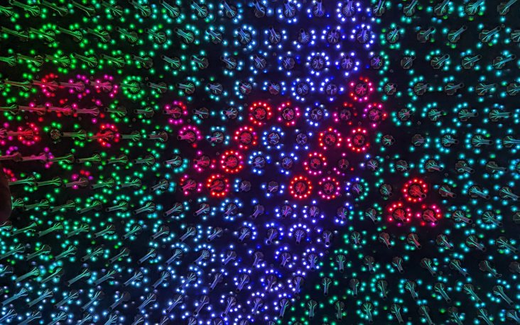
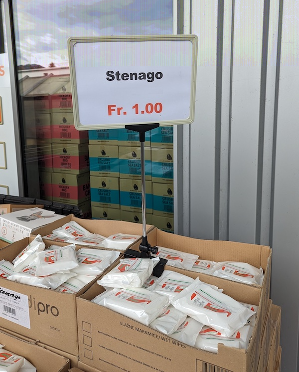
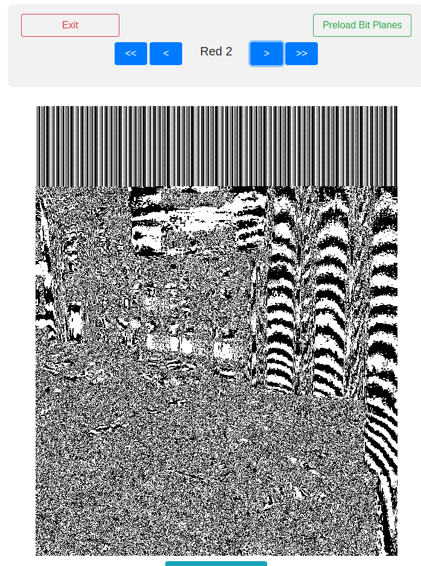
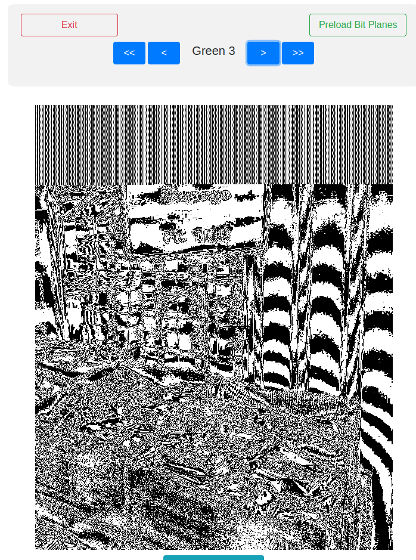
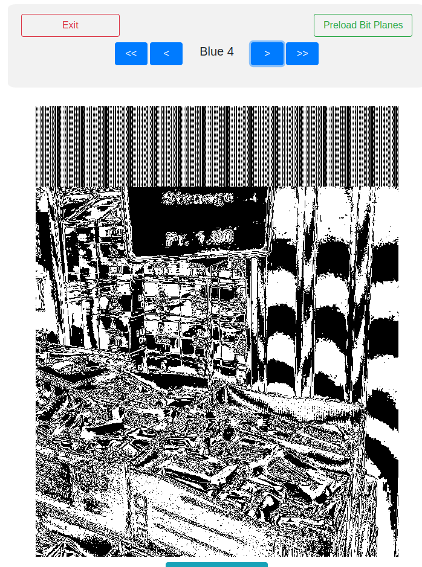
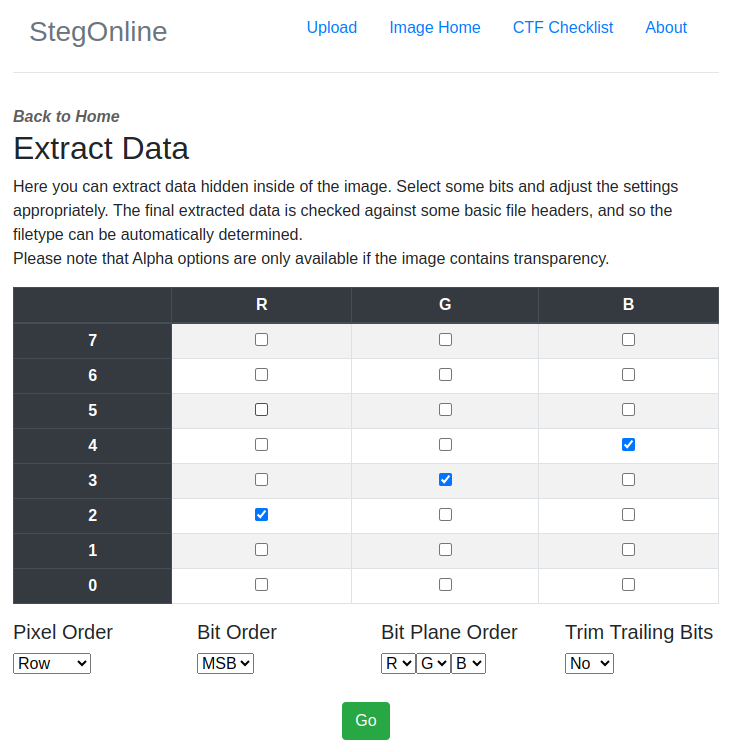
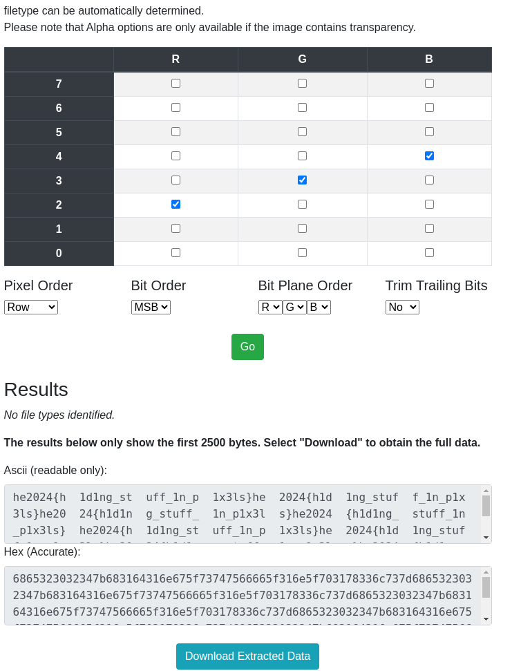

# Challenge "Stenago"

My friend sent me this image, but I don't get the message.

Never heard of this stenago thing.

# Solution

The normal steganography methods were not successful. But from Discord I received a hint from xdjibi to investigate the image itself.

By doing so, I could see that there are artefacts like a barcode in the top of the image. By trying several tools I found this one: https://georgeom.net/StegOnline/extract

By playing around with the bit plane, I could find that with Red 2, Green 3 and Blue 4 the barcodes are getting well visible:

With extract data, it is possible to configure the above said values simultaneously:

After that, the flag is revealed:

Credits for assistance: xdjibi

## The flag
    he2024{h1d1ng_stuff_1n_p1x3ls}
