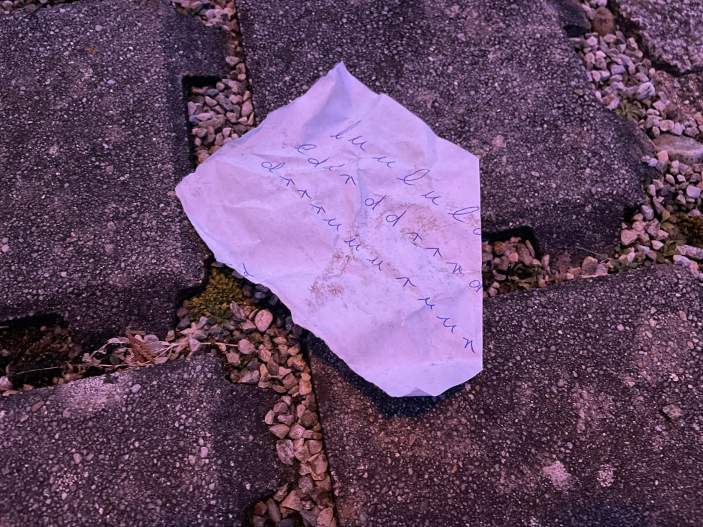

# Challenge "Hacky Easter Letters"

Little rabbit Huey from the US had decided to send some Easter greeting to his friend Thumper.

He starred a long time on his keyboard and thought about how to do something nice for him.

Finally he created a cute secret message with his computer, together with a little note to decipher it.
Clumsy delivery guy dropped the note with the secret instructions in the dirt when he delivered the
greeting message. Hopefully you can help Thumper to decode it nevertheless?

[Little Rabbit's web site](http://ch.hackyeaster.com:2408/)

Hint:
If you think the dots are the most important thing, redimension your efforts and shift your focus on something else.

Be careful not to get on the wrong "paht"!

# Solution

## The flag
    he2024{}
