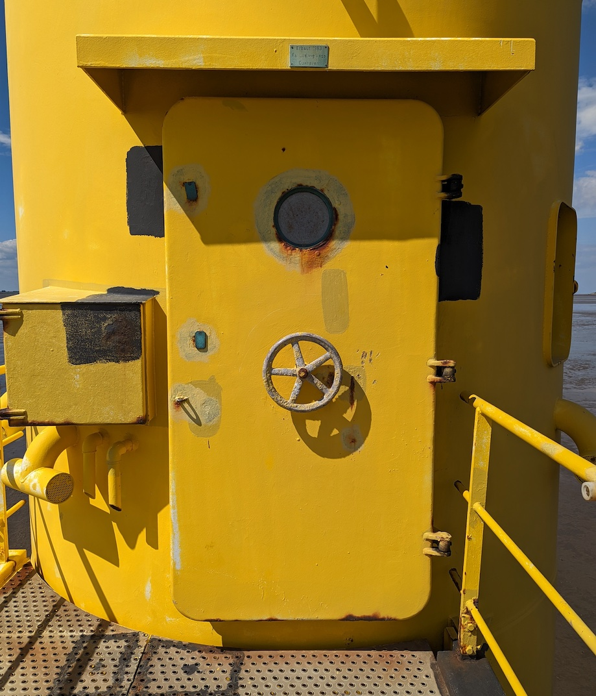

# Challenge "Yellow Door"

I found this suspicious door on an island during my last trip.

Can you find out where it is located?

Download the image file below and ignore the title image.

🚩 Flag
- name of the island this thing is standing on, wrapped in he2024{ }
- first word only, without suffixes or numbers
- example: Galapagos Islands would become he2024{Galapagos}

# Solution

The image itself contains a label over the yellow door. On the label we can read the following information:

    Erbaut 1983
    Fa Ludwig Voss
    Cuxhaven

With that information, we can figure out that this is a construction company from germany: https://cuxpedia.de/index.php?title=Ludwig_Voss_GmbH_%26_Co.KG

So we can search for something build by them at 1983 on a German island with probably more than just one word and/or a suffix.

So with ChatGPT, I searched for all German islands and narrowed down to those with these conditions. On "Langlütjen I" I could find "Radarturm Tettens": https://de.wikipedia.org/wiki/Langl%C3%BCtjen

Credits for assistance: AstroViking

## The flag
    he2024{Langlütjen}
