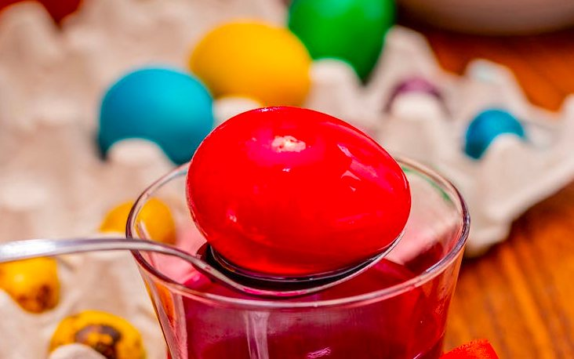
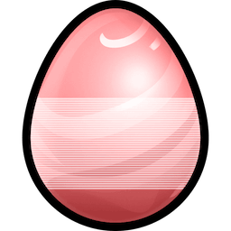

# Challenge "Egg Design"
 

**Difficulty:** 🤓 noob | **Category:** 🌐 web

Hope you like the design of this year's eggs!

# Solution
I recognized that each layer is an URL to an image. The red one was an URL to https://www.hackyeaster.com/img/eggdesign_layer4.png

By adjusting the URL number from 4 to 1 we receive to flag-egg with the QR code (this is the egg on the bottom):
https://www.hackyeaster.com/img/eggdesign_layer1.png

## The flag
    he2024{blu3_gr33n_y3ll0w_4nd_r3d}
