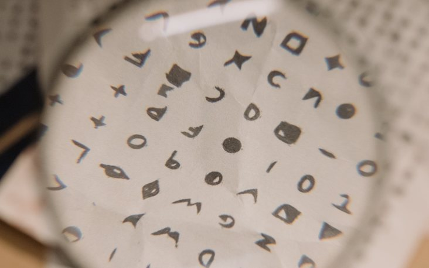

# Challenge "PEM Flag"

I got this flag, but it seems to be encoded in a format called "PEM".

    -----BEGIN FLAG-----  
    aGUyMDI0e2hleC1hLWRlY2ltYWx9  
    -----END FLAG-----  

# Solution
I used [CyberChef](https://gchq.github.io/CyberChef/ "CyberChef on GitHub") and let auto detection solve the challenge (magic wand):

By doing so, the flag was revealed and we can see, that "PEM to Hex" abnd then "From Hex" does the trick.

## The flag
    he2024{hex-a-decimal}