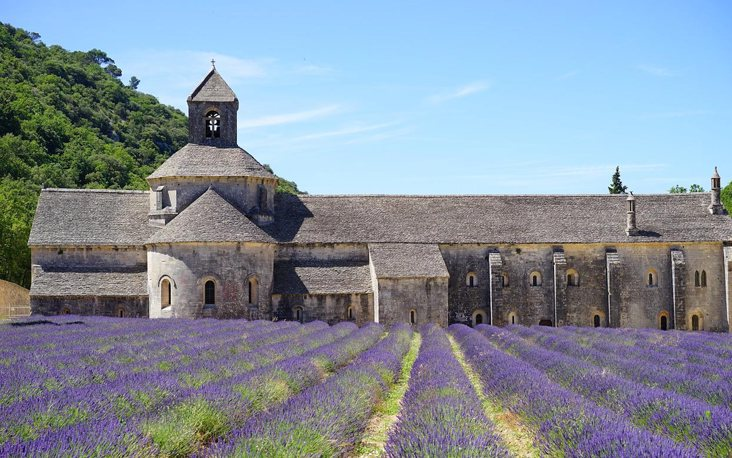
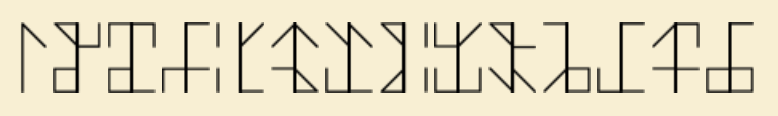
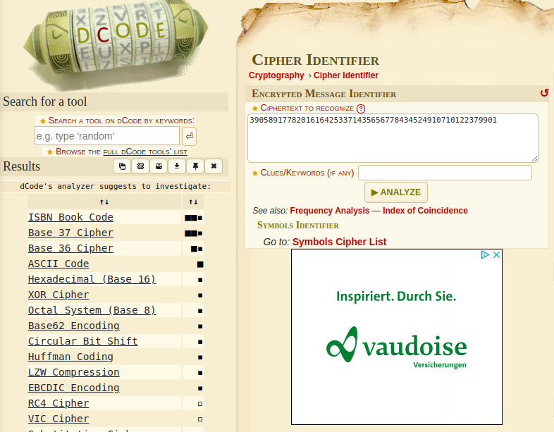
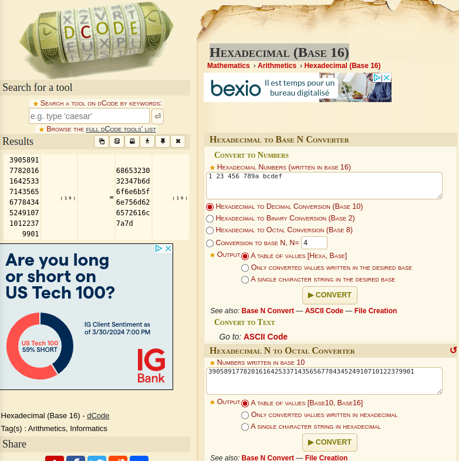
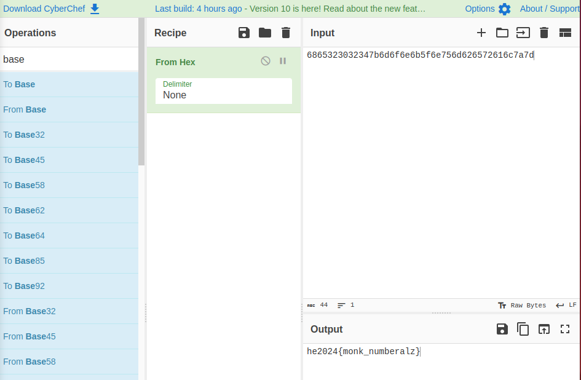

# Challenge "Monastery"
 

**Difficulty:** 🎮 easy | **Category:** 🔐 crypto

You found some strange symbol in an old monastery. Can you make any sense out of it?

Hint: After decoding the symbols, two more conversions are needed.

Hint update: After decoding the symbols, combine them to one single number, and do two more conversions.

# Solution
By doing a Google picture reverse search it is getting clear, that we are talking about a "Cistercian numerals" cipher.

- Wikipedia article about that: https://en.wikipedia.org/wiki/Cistercian_numerals
- Guide about cipher: https://historysurvivalguide.com/cistercian-numerals/
- Tool for decoding the cipher. With that, we receive the following numbers (last column for DCode reproduction): https://www.dcode.fr/cistercian-numbers

    1 letter: 3         char(3)

    2 letter: 9058      char(15)char(8)char(39)

    3 letter: 9177      char(39)char(21)char(17)char(7)

    4 letter: 8201      char(38)char(21)char(1)

    5 letter: 6164      char(16)char(36)char(21)char(4)

    6 letter: 2533      char(13)char(3)char(32)char(25)

    7 letter: 7143      char(37)char(21)char(14)char(3)

    8 letter: 5656      char(15)char(35)char(6)char(26)

    10 letter: 7784     char(27)char(37)char(4)char(18)

    11 letter: 3452     char(33)char(24)char(2)char(15)

    12 letter: 4910     char(34)char(29)char(11)

    13 letter: 7101     char(37)char(21)char(1)

    14 letter: 2237     char(32)char(22)char(7)char(13)

    15 letter: 9901     char(39)char(29)char(1)

3 9058 9177 8201 6164 2533 7143 5656 7784 3452 4910 7101 2237 9901

Combining those numbers gets the following value:
39058917782016164253371435656778434524910710122379901

The two transformations took me a lot of time. I thought to reuse the same approach as ealier with "Cistercian numerals". Thanks to "spire" I received the hint, that I am finished with "Cistercian numerals".

So I tried another approach. I used https://www.dcode.fr/cipher-identifier and entered the number there.

This produced the following possible algorithms:

So I tried all algorithms on DCode and their outputs with CyberChef's magic wand detection.

With "Hexadecimal (Base 16)" I could get an output, which was detected by CyberChef's magic wand:

CyberChef then proposed "From Hex" to receive the flag:

## The flag
    he2024{monk_numberalz}
