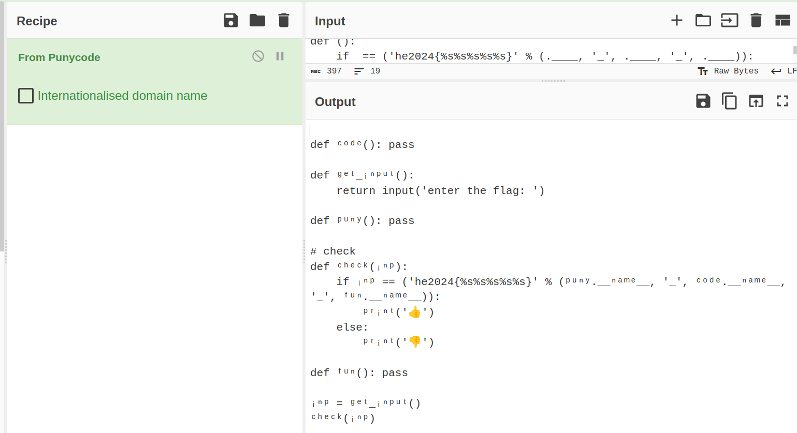

# Challenge "Weird Code"

This code looks so weird!

Can you make it work and find the flag?

[weirdcode.py](weirdcode.py)

    #coding: punycode
    def (): pass

    def _():
        return input('enter the flag: ')

    def (): pass

    # check
    def ():
        if  == ('he2024{%s%s%s%s%s}' % (.____, '_', .____, '_', .____)):
            ('')
        else:
            ('')
            
    def (): pass

    = _()
    ()-sh9hxeq1axa55h2bx9331hmam35h8d6do5e2bken4ef88e1gtnjfyfqao95a5e72bnb1ak3a8cya3agh0ac6oza8ac1b0c4d8a8dt08wicl3g0a4aik595n0cc7d9fc39h9bv049jqba4am6aetodu1avljn7255748a0ja

# Solution
Spoiler: I don't fully understand this challenge or how it works in detail.

The challenge suggests that punycode is used and therefore decoding as such should reveal the flag.

I tried this in several ways and approaches. But one try without comment (but with keeping the first line empty) in combination with CyberChef (From Punycode) reveals the flag:

What I can say is, that "#" is not an allowed punycode character.

## The flag
    he2024{puny_code_fun}
