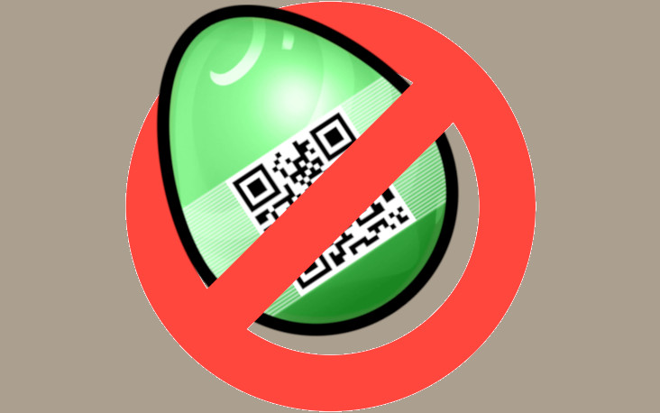

# Challenge "Egg Buster"
 

**Difficulty:** 🮠easy | **Category:** 🌠web

Ghostbusters go Egg Hunting!

Open their webpage and find the egg.png.

[Egg Busters web site](http://ch.hackyeaster.com:2407/)

Note: The service is restarted every hour at x:00.

Hint: You don't need to have an account (sign-up doesn't work anyway). Do some research!

# Solution

So we know we have to find an egg.png. So I investigated the article banners from the blog posts.

Here are two urls of the banner pictures:

    http://ch.hackyeaster.com:2407/content/images/2024/03/no_eggs.webp
    http://ch.hackyeaster.com:2407/content/images/2024/03/hotel_ruine.webp

Since it is clear, that the flag is named egg.png, we just have to figure out the correct URL. We do not know on which month the egg.png was published, but we can assume it was in a blog post. And we can use ".." to do a path traversal method.

And by using this one, we actually receive the flag egg.png: http://ch.hackyeaster.com:2407/content/images/../../egg.png

Sitenote: In writing this, I realised that the "../../" in the path actually goes up two folders in the file structure. So egg.png is actually in the root directory of the website: http://ch.hackyeaster.com:2407/egg.png

## The Flag 🚩
    he2024{p4th_tr4v3rs4ls_st1ll_h4pp3ns}
