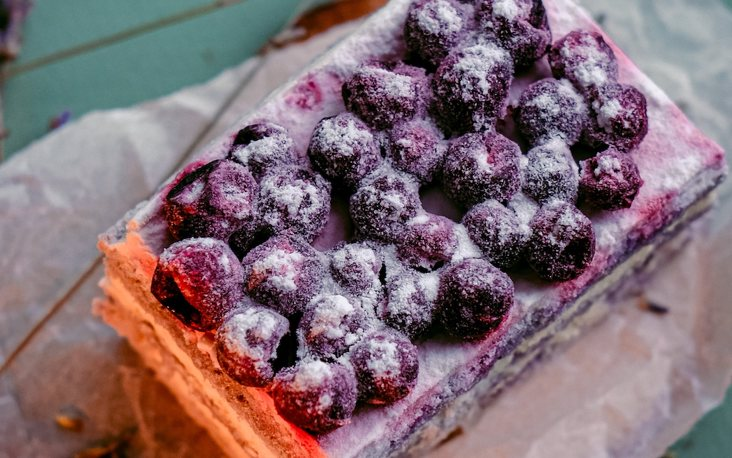

# Challenge "Piece of Cake 1"
 

**Difficulty:** ⚖️ medium | **Category:** 🔐 crypto

Bunny Bob grinned from ear to ear, as he told the story of his new idea. "ROT. It's just ROT. Nothing more. But get this: Each letter is rotted individually, and I am using different numbers for each letter!".

Fred Rabbit wasn't impressed. "Hmm. Interesting. How do you communicate the needed individual rotations to the recipient?".
"Oh. That", Bob smiled. "You could say it's a piece of cake."

Here's the encoded flag:

    ii35;6^Ykf|h~j8adgf7ve5uuiw37wflaj}x`9rbgj|7† 

# Solution
Hint from Discord: Mar 14  - > Day of Pi!

We apply for each character a ROT (ROT47 because of special characters). Since we know it starts with "he2024{", we might identify a pattern.

After some try and error, I came to the conclusion that we have to calculate a rotation based on pi and the ASCII numbering.

|Number of PI|Cipher Char|ASCII|Difference to Plaintext|Plaintext ASCII|Plaintext Char|
| --- | --- | --- | --- | --- | --- |
|3| | | | | |
|.| | | | | |
|1|i|105|-1|104|h|
|4|i|105|-4|101|e|
|1|3|51|-1|50|2|
|5|5|53|-5|48|0|
|9|;|59|-9|50|2|
|2|6|54|-2|52|4|

So by proofing that this approach seems to work, I could script a python script to apply the method to the full cipher.

[solver.py](solver.py)

    def solve_rot_with_ascii_and_pi():
    numbers_after_decimal_point_of_pi = "141592653589793238462643383279502884197169399"
    cipher = "ii35;6Ykf|h~j8adgf7ve5uuiw37wflaj}x`9rbgj|7†"

    flag = ""
    for index, c in enumerate(cipher):
        plaintext_char = chr(ord(c) - int(numbers_after_decimal_point_of_pi[index]))
        flag = flag + plaintext_char

    print(flag) # he2024{That_wa5_a_b1t_1rrat10nal_but_0kaaay.}

    if __name__ == "__main__":
        solve_rot_with_ascii_and_pi()

## The Flag 🚩
    he2024{That_wa5_a_b1t_1rrat10nal_but_0kaaay.}

