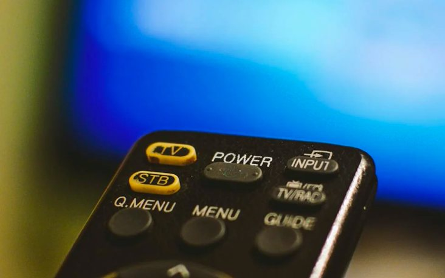

# Challenge "Primetime"
 

**Difficulty:** 🎮 easy | **Category:** ⚄ misc

Time for a TV evening!

🚩 Flag
- uppercase
- wrap in he2024{ and }

[primetime.txt](primetime.txt)

    01 Channel 1
    02 Tele 2
    03 El Tele Tre
    04 Tele 4
    05 Local News
    06 International News 24
    07 Epic Movies
    08 CMM
    09 Film9
    10 Cinema-X
    11 Cold North TV
    12 Southern TV 5
    13 Only News
    14 Sports
    15 More Sports
    16 Most Sports
    17 Music & More
    18 Comic Cosmos
    19 All The Comics
    20 TV Twenty
    21 Plenty And One
    22 Children's Channel
    23 No Man's Choice
    24 Survival Channel
    25 Gaming Overload
    26 Game Duck
    27 Hacky Easter TV
    28 CTF
    29 Dingo TV
    30 Rockatansky
    31 Only Techno
    32 1337 TV

# Solution
Prime number locations in the list: 02, 03, 05, 07, 11, 13, 17, 19, 23, 29, 31

Extracting the first letters of the TV channel names at these positions:

    Tele 2: "Tele 2" - The first letter is 'T'
    El Tele Tre: "El Tele Tre" - The first letter is 'E'
    Local News: "Local News" - The first letter is 'L'
    Epic Movies: "Epic Movies" - The first letter is 'E'
    Cold North TV: "Cold North TV" - The first letter is 'C'
    Only News: "Only News" - The first letter is 'O'
    Music & More: "Music & More" - The first letter is 'M'
    All The Comics: "All The Comics" - The first letter is 'A'
    No Man's Choice: "No Man's Choice" - The first letter is 'N'
    Dingo TV: "Dingo TV" - The first letter is 'D'
    Only Techno: "Only Techno" - The first letter is 'O'

Combining these letters: TELECOMANDO

## The flag
    he2024{TELECOMANDO}
