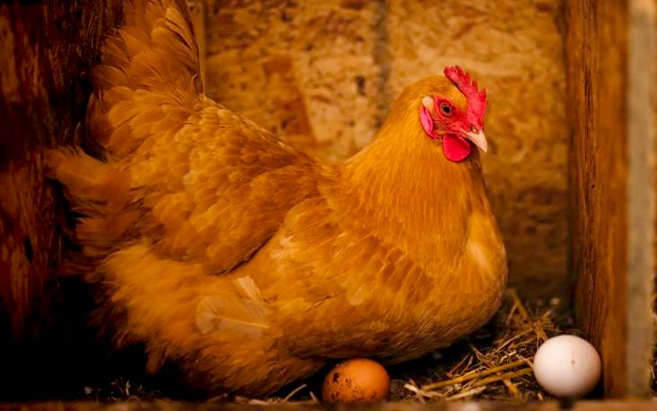
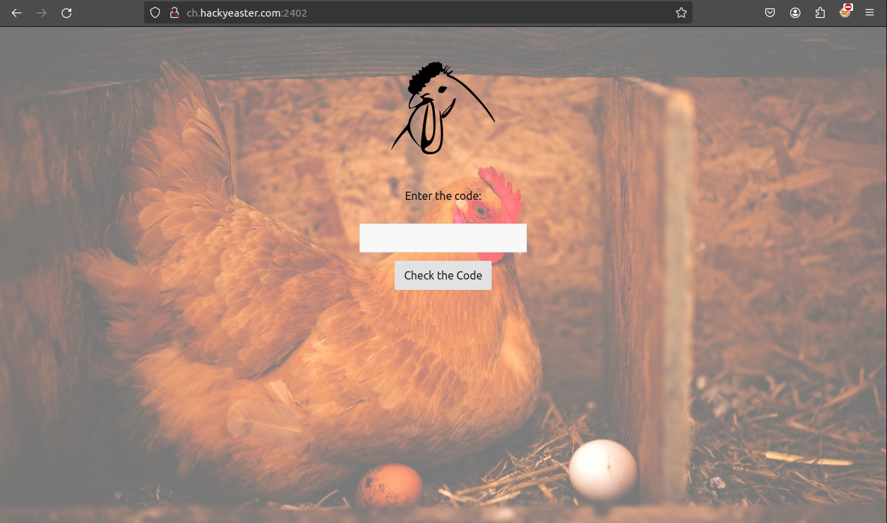
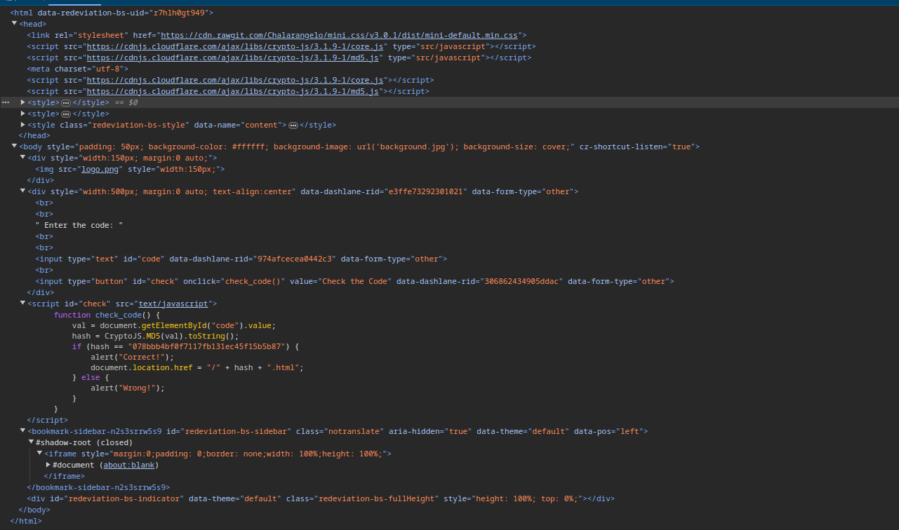
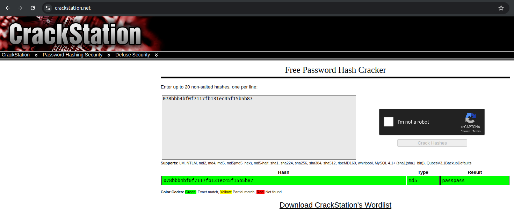
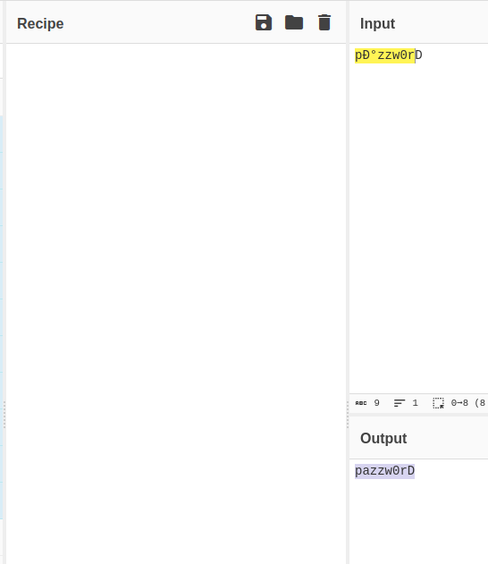
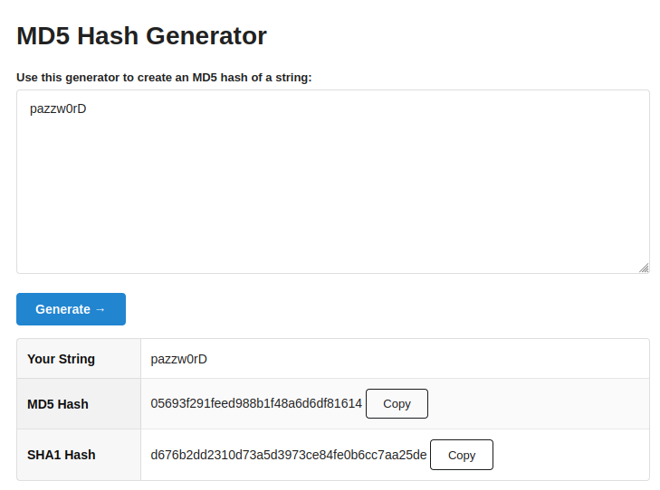
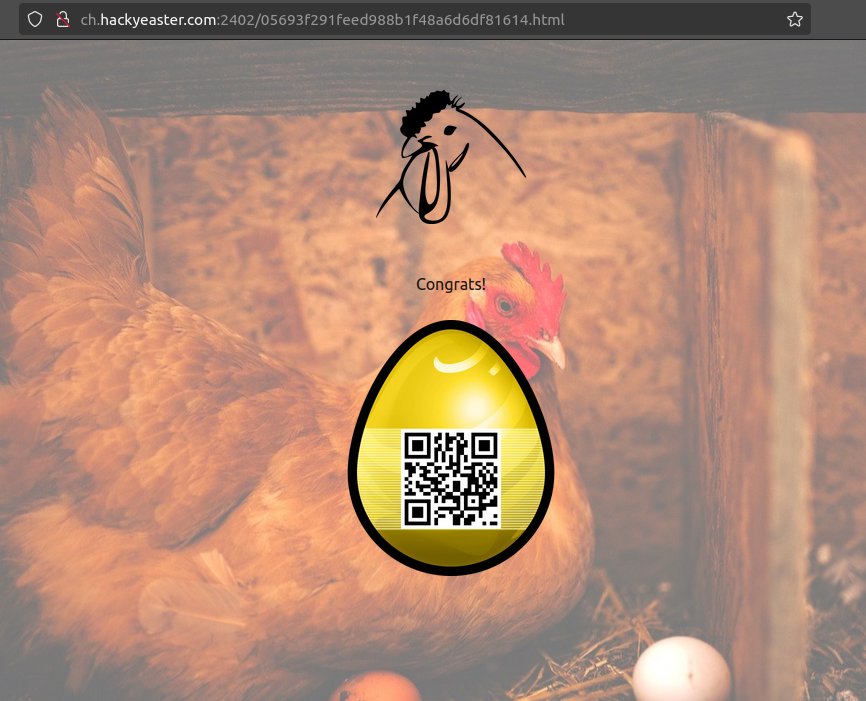

# Challenge "Tricky Chicken"
 

**Difficulty:** ⚖️ medium | **Category:** 🌐 web

Tricky Chicken can give you an egg.

But you must know the right code word!

[Tricky Chicken's web site](http://ch.hackyeaster.com:2402/)

Note: The service is restarted every hour at x:00.

# Solution

When accessing the site, we are asked about a code:

When investigating the source code of the website, we can see Javascript code to validate the input:

    function check_code() {
        val = document.getElementById("code").value;
        hash = CryptoJS.MD5(val).toString();
        if (hash == "078bbb4bf0f7117fb131ec45f15b5b87") {
            alert("Correct!");
            document.location.href = "/" + hash + ".html";
        } else {
            alert("Wrong!");
        }
    }

As we can see, if the MD5 hash matches the input, we will be redirected to "hash".html. By using crackstation, we can see that "passpass" matches the MD5 hash "078bbb4bf0f7117fb131ec45f15b5b87":

But when entering "passpass", the site still returns "Wrong". So there must be something else.

By further investigating the code, we can see in the HTML a javascript src parameter:

    

By direct accessing this script, the true source code is revealed: http://ch.hackyeaster.com:2402/text/javascript 

    var head = document.getElementsByTagName("head")[0];
    var script = document.createElement('script');
    script.src = 'https://cdnjs.cloudflare.com/ajax/libs/crypto-js/3.1.9-1/core.js';
    head.appendChild(script);
    var script2 = document.createElement('script');
    script2.src = 'https://cdnjs.cloudflare.com/ajax/libs/crypto-js/3.1.9-1/md5.js';
    head.appendChild(script2);

    function check_code() {
        val = document.getElementById("code").value;
        if (val.length == 8 && val[0] == 'p' && val[1] == 'а' && val[2] == 'z' && val[3] == 'z' && val[4] == 'w' && val[5] == '0' && val[6] == 'r' && val[7] == 'D') {
            alert("Correct!");
            document.location.href = "/" + CryptoJS.MD5(val).toString() + ".html";
        } else {
            alert("Wrong!");
        }
    }

Here we can see, that the real password is "pаzzw0rD". But that is longer than 8 characters. When entering that to CyberChef, we can see that "а" translates to a:

When entering "pаzzw0rD", the message "Correct!" appears. So now we only have to generate the MD5 hash of that and access the flag directly:

Now we can access the site http://ch.hackyeaster.com:2402/05693f291feed988b1f48a6d6df81614.html to get the flag:

## The flag
    he2024{such_4_tr1cky_ch1ck3N!}
