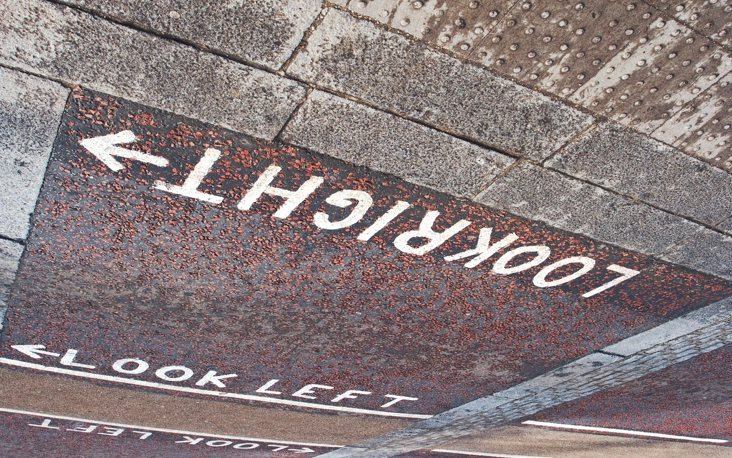

# Challenge "gge_deserver"
 

**Difficulty:** ⚖️ medium | **Category:** ⚄ misc ; < > reversing

?ssem siht elgnatnu ot em pleh uoy naC .desrever tog ti dna gge ym deppord I !pleH

[gnp.galf](gnp.galf)

# Solution
Based from the challenge text and the file name, everything is reversed and has to be reversed back to the flag.png.

The main question is, what reversing is required. So after trying different approaches, I came to the idea to just read the bits in reverse. For doing that, I generated a script:

[solver.py](solver.py)

    def reverse_bits(byte):
        # Convert the byte to binary string and reverse it
        reversed_byte = bin(byte)[2:].zfill(8)[::-1]
        # Convert the reversed binary string back to an integer
        return int(reversed_byte, 2)

    def reverse_file_bits(input_file, output_file):
        with open(input_file, 'rb') as f_in:
            with open(output_file, 'wb') as f_out:
                byte = f_in.read(1)
                while byte:
                    # Reverse the bits in the byte
                    reversed_byte = reverse_bits(ord(byte))
                    # Write the modified byte to the output file
                    f_out.write(bytes([reversed_byte]))
                    byte = f_in.read(1)

    input_file = 'gnp.galf'
    output_file = 'flag.png'

    reverse_file_bits(input_file, output_file)
    print("Bits reversed successfully and written to", output_file)

After that, the flag is revealed:

The string "}):won_rof_gnisrever_hguone{4202eh" has just to be reversed for entering the flag.

## The Flag 🚩
    he2024{enough_reversing_for_now:)}
