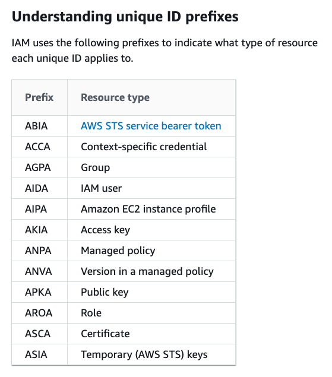
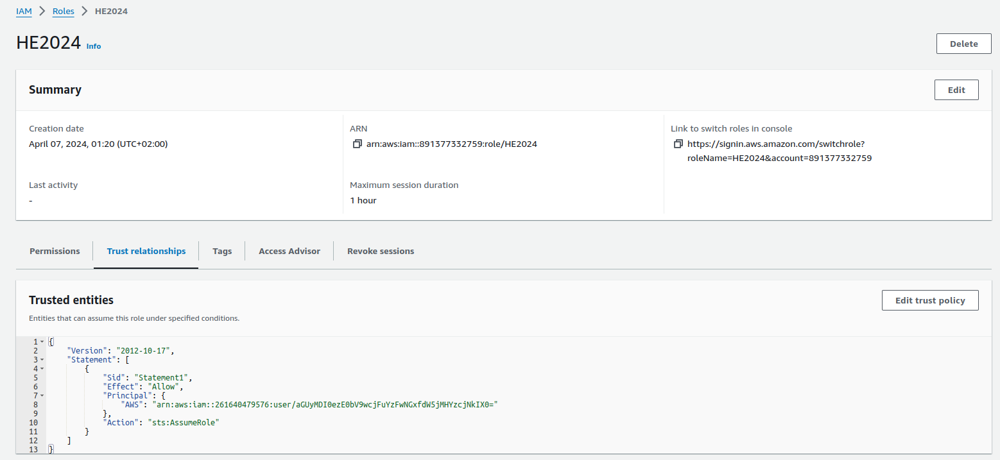
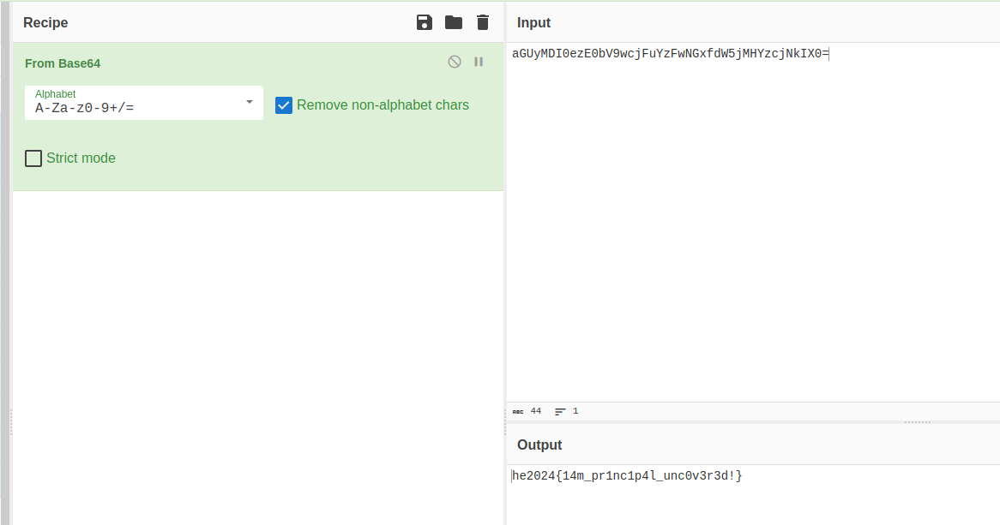

# Challenge "Unknown Identity"
 

**Difficulty:** ⚖️ medium | **Category:** ☁️ cloud

I detected an attempt by an unknown identity to access our cloud account. Can you help me find out who it was?

All I have is this string: AIDATZ2X44NMHZV4BWEMR

# Solution
Based of https://awsteele.com/blog/2020/09/26/aws-access-key-format.html we are talking of an AWS IAM user resource type because of the starting "AIDA":

Based on the description from https://hackingthe.cloud/aws/enumeration/enumerate_principal_arn_from_unique_id/ we can derive the arn by creating a role of type "trust policy":

    {
        "Version": "2008-10-17",
        "Statement": [
            {
                "Sid": "Statement1",
                "Effect": "Allow",
                "Principal": {
                    "AWS": "AIDATZ2X44NMHZV4BWEMR"
                },
                "Action": "sts:AssumeRole"
            }
        ]
    }

After saving the role, we can check the trust relationship to receive the ARN.

After checking the username with CyberChef, we receive the flag after decoding it with Base64:

## The flag
    he2024{14m_pr1nc1p4l_unc0v3r3d!}
