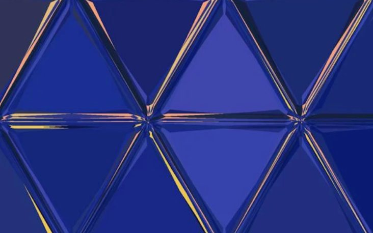

# Challenge "Code³"
 

**Difficulty:** ☢️ hard | **Category:** 🔐 crypto

Someone invented a new code, can you crack it?

    5.3 5.1 3.5 1.1 4.4 3.3 5.4 4.2 1.1 5.1 3.5 5.9 3.1 2.3 2.2 4.5 2.3 3.1

🚩 Flag
- uppercase
- no spaces
- example: he2024{FLAGFLAG}
- Hint: I == J

# Solution
By making I = J, we have an english alphabet of 25 characters (5 times 5).

I tried several approaches but I was a long time stuck. Someone mentioned that the picture of the triangles is a hint.

So tried to bring the Alphabet in a triangular shape so that the 25 characters are evenly arranged:

        A
       BCD
      EFGHI
     KLMNOPQ
    RSTUVWXYZ

Then we can use the coordinates like [row].[character]. Example 5.3 = Row 5, Character 3 => T

By using that decoding method, we receive "TRIANGULARIZEDCODE".

## The Flag 🚩
    he2024{TRIANGULARIZEDCODE}
