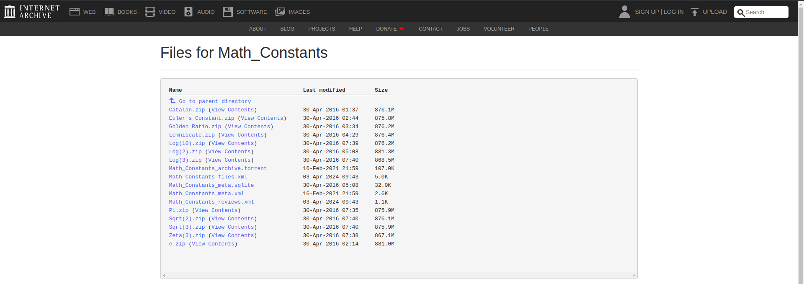

# Challenge "Piece of Cake 2"

This time, Bunny Bob was lost in thoughts. "I cracked your code", the young bunny from before told him. "Is this using the same number again? It's irrational to think this would work twice."

"No", Bob replied. "It's not that irrational at all, when you have a closer look."

"But my approach doesn't work here at all!" Bunny Bob sighed.

"It's the same mechanic. Just don't start at the beginning. Start right after every hacker's birthday."

His young friend looked at him quizzically and hopped away, none the wiser.

Here's the encoded flag:

    he876:|I94kcxk6uohyp9t4cn}ti:vtcir7foowg8tbk8sfy~4166~
    006746167628631299553037650351968061839778308567603651

Hint: It's not 𝛑 this time.

# Solution
Based on the hints from the Discord chat, we have to download irrational numbers to a precission of billions. I found this cool archive which provides exactly such entries: https://archive.org/download/Math_Constants

After downloading the files, we can extract them and let the following grep command over each file:

    grep -oP '0067461\d{46}1' e\ -\ Dec.txt | head -n 1000

This works since from Piece of Cake 1 we know the algorithm and therefor can assume prefix "0067461" for "he2024", the 46 chracter length and "1" for suffix "}". The command will output up to 1000 matches for each file we run it over it.

Here the output for e:

    006746167628631299553037650351968061839778308567603651
    006746128188881742386218726149777819034286566741593871
    006746122017412795824063076491567721040061126512647401
    006746121331147430595791505536955497722278150184686141
    006746129474435789586114087774148047103877147557563881
    006746110052776874596686454656467411245940306037426521
    006746107929714855045824706898608496875289449779322281
    006746181495787446286817064290959369575165873734244511
    006746192718046109220018550859870273532198048101458201
    006746167119685045069206556028433533152830875964468961
    006746192817481447874109226470813895206644191457518071
    006746127157400333909158315264179319166484295996758211
    006746115369370721338661598451721732491265770803906111
    006746196798971858829057448573266309658275927709723981
    006746130158594281509176820132337126344703777728473261
    006746183499123883054730051615252073730973875420818711

These outputs are then stored in a txt files in the folder "possible_keys".

Next we take the script from Piece of Cake 1 and adjust it to go over each *.txt file in "possible_keys" and try all keys from all files against the ciphertext.

[solver.py](solver.py)

    import os

    def solve_rot_with_ascii_and_irrational_number(key, cipher):

        index = 0
        result = ""
        for c in cipher:
            plaintext_char = chr(ord(c) - int(key[index]))
            result = result + plaintext_char
            index = index + 1

        print("Flag {0} for key {1}".format(result,key.replace("\n", "")))

    def read_lines_from_subdirectories(root_dir):
        all_keys = []

        # Walk through all subdirectories and files
        for subdir, dirs, files in os.walk(root_dir):
            for file in files:
                keys_per_file = lambda: None
                keys_per_file.file = file
                keys_per_file.all_lines = []
                file_path = os.path.join(subdir, file)

                # Open each file and read its lines
                with open(file_path, 'r') as f:
                    lines = f.readlines()
                    keys_per_file.all_lines.extend(lines)

                all_keys.append(keys_per_file)

        return all_keys

    if __name__ == "__main__":
        root_directory = './possible_keys'
        all_keys = read_lines_from_subdirectories(root_directory)
        cipher = "he876:|I94kcxk6uohyp9t4cn}ti:vtcir7foowg8tbk8sfy~4166~"
        for entry in all_keys:
            print("File {0}".format(entry.file))
            for key in entry.all_lines:
                solve_rot_with_ascii_and_irrational_number(key, cipher)

            print("\n")

Output of the script:

    File lemniscate.txt
    Flag he2024{H3+f\rc3rk`xi6r2]murb5ms[br3`njs_/kYk5mbqz-/25} for key 006746116957683348173226182759187046154899903648472411
    Flag he2024{H12j`ve.mkdwj7m4]l|tc2rpbdo5^fone5nYb4kev{3+1.} for key 006746118213268844262706210684415328909236994813316581
    Flag he2024{E52b`rg0mjeth7n3Znwpc7un`cm6`jgs`3oZf0s]y|.1.-} for key 006746144293646853582619064631636516584755858090260891
    Flag he2024{F40d[sc3sobpi5l,_ftrf7stben1biiwg8m`j6o]u{-*00} for key 006746135478583206974884892333014464660007212494377661
    Flag he2024{B0.fbog0thbxo2n2Zl}sd4rt[dn1djgu`5pbg4rct|/.15} for key 006746179651946176117629201564085462582734044135253511
    Flag he2024{D5/f]pd.lmcun2o+cmtpe5on[bp7]jko`0l]d5mbvx-.11} for key 006746154556878925427590194457687209548788573643673551
    Flag he2024{D1-jcpe/poeqk5o2clvni1nk_hr.ffjug6p\e8j^t}3(/6} for key 006746158710867503854520276098941090952024660985119701
    Flag he2024{D44e[sj0mgbpk7q-alwmi9qn^di.diove7lZk5qes~1-03} for key 006746155068516886952372267015655992601218803216034631
    Flag he2024{E0/c_ug.lhcph1k2`ktr`4rq^dm.`ngod3t\c8o^t}-/-3} for key 006746149584348975988923392964355596188350680485172931

    File sqrt2.txt
    Flag he2024{I2-bcwd2mmbyl3q+]gzna9sq_ii3^ngsg3mZi3qdp~0+10} for key 006746107790174826046396736813340948184057825229046561
    Flag he2024{D3,bawi-rgevj2t0Zgts`2qr[hn5aooqb0naj0m^y{2-/.} for key 006746156892129383367049791985281425006586118680324781
    Flag he2024{I1,i]wd/toawo2t.\htna5vqbei0ahos`7pYh2obu|+//4} for key 006746108826177107217067696850314975704714936444292721
    Flag he2024{I61j\th.tncpo6n4\nxti5po]fp4_nkpc6p_j2p^uu/*02} for key 006746103317438115913607050056563237147424316384957641
    Flag he2024{H6,e`sj6lfhvk7p/afyti8mt_bq7cjlub3sbk3k_qu./1.} for key 006746113863510990352452840029047103532551005878962581
    Flag he2024{E6,k]ui/mkfwm5l-\n}o`9rm[`o2_ons^5r\d1s_y|+(61} for key 006746143806327842234877005914789357014932677070299051
    Flag he2024{E83g\rk2pjbwg3t4[nylc1nlacj.bijs^2mbf3q]w~++2/} for key 006746141147604556296008048698826894654967055292096471
    Flag he2024{H62b\rk1ul_qp1p0]h|qi3mn^go2_imnc0n`d0sfx|0.35} for key 006746113297605039808446613079652357629486278001243311
    Flag he2024{C2+bcuk4qlaqi2q+ce}kf7vlZbn/djgof3q]j2las|..-5} for key 006746167990302437877390909330897482588153516756263911
    Flag he2024{G03fcqc3oobqm3k4]h|ka5op_hn3]fnv`4o_f5jeuv3+41} for key 006746129150783606836906619857441449911745353914816251
    Flag he2024{B0,f_ok6phfpg9s/Zfwph7sp`cn5doin_3kbj2ncy~2/60} for key 006746179854900572990159864133436422069859016530022061
    Flag he2024{I31hcxb5qigvo2t0`julb3rt]gr4bmmwe2r_b2l^w}3(60} for key 006746106330091461317043488774062034220262396782119061
    Flag he2024{I2+c]uf4ngcvp1m-_e|pb4mpbdi6dmoo`4k]k2max|,026} for key 006746107986352785308774914769415912208749506651281401

    File golden_ratio.txt
    Flag he2024{A2+h\td.pl_qh4m-cevq`8rkbii2fjgpd3m\c4qer~3/3.} for key 006746187937478539885770973924910950587357684217012381
    Flag he2024{G81c_ui0tl`ui4q-al}lf1noccl2]kkud/p\i7oay|++-5} for key 006746121384326138475372208398506659442394621450296911
    Flag he2024{F1-hcsb2ui_yj3t,^n{og7qpZhq0]hfra6qZg4l_t}/-46} for key 006746138730594069066085025235491179795623844775154201
    Flag he2024{@61j[wb-qk`yp3p1Zezre7qo_ir7`llr`3t_j1sct~,-..} for key 006746193318199448006439932435540006335750317035084881
    Flag he2024{B0/i_vg6sffwn6o2akvrb:opbco1^onpa1lYj/mfwy4(42} for key 006746179524240292223522372707416368017678919602509241
    Flag he2024{@5/fbxe2mj_pl3l4^e|me4opbhj4_lht_0s]k7sdr|-,5/} for key 006746194551064859946805917467411837373881501027275171
    Flag he2024{B3/c]xg1rgfrl4k._f{og8ot\gk7`foq`/r_d6o^y~,)-/} for key 006746176586045382745964825227072706906792372480088971
    Flag he2024{C4/cbwf2ugcyl8t,Zfuo`2ok^fn2fghr_1l`f1n`s{.,0-} for key 006746165581154085041089885987953450875878257566365691
    Flag he2024{A6.kcwk6uoauh9o3amwqd6utagl6]lnu^0lZd/l_tz2.13} for key 006746183600100007480512163541022619312988879775423531
    Flag he2024{E0/c`qd-tgfpl0p1`n}n`8skaio5`hhsd2r\j0qeyx4)60} for key 006746149583779182949433006923920326774362618210608061
    Flag he2024{G0/i^wb-lgduo0s+_h}r`9nncdm3]nive6lai2s_ww1+36} for key 006746129525199984419194602918605549161228126072736301
    Flag he2024{F23bcoc1nj_wo1s-\nxqi9vqcaq4_mhpa3tbj5q_xx-*4-} for key 006746137190985759218177053010308137277650013271677291
    Flag he2024{I4.ibwf5ulfvp1m.[ltt`2urcen0bfjtg5tbh3r_tw//45} for key 006746105621151032308768290981204474953030035175752211
    Flag he2024{E6/h[xg6mmfti7n2Zfwtb1nnael0bkiv^5m`b3p`ww,153} for key 006746143538040822572629860798624674461937295362780131
    Flag he2024{G6,g^qe4uf`uo4p3biyp`3oq[fq.]jnoe/m^j3mcuu3013} for key 006746123845762098415411544977383199518297415634911531
    Flag he2024{I71f`of.qidsn4t0_extb9nk^di6^nfv_0m^f1jdv~/+02} for key 006746102353958464625044950718955918191887457923056641
    Flag he2024{D13i_uh2tjbuk1q3]luod2mpZci2amnvc1nYg/oduz4,52} for key 006746158124334156458316285589496955211476949424405141

    File catalan.txt
    Flag he2024{B7.hZpd-nghsl6m3[m|ta8qr]dp0^ijq`8q]b8lbsy4*-1} for key 006746172639879780643718110825265278656703590746507951
    Flag he2024{D81ibrk6pobuj7t/bn{me7pkcbm3emira/m\f4j]v{0+-5} for key 006746151321600506462051027436907541265697654993346911
    Flag he2024{I91hbse-sjepi6m1`jusd5sn^ho0dkhp^/tac4rbt{+.45} for key 006746100331569253973733481553651372477990184145393211
    Flag he2024{G0+i_pj0ohbun0m,[jush5sqchi3fmhn_/s^e4s_u{1-5-} for key 006746129924816676429788481153301940279891464074334191

    File e.txt
    Flag he2024{C2.i[rh5sf_tk6t1\hxtf5uk]ar1egln`1l_k0n`rx4.01} for key 006746167628631299553037650351968061839778308567603651
    Flag he2024{G13c[pc5nkfvh3r3[g{nh6mm\bj6]olse0n]e2lbxy+../} for key 006746128188881742386218726149777819034286566741593871
    Flag he2024{G74j\tj4nfcqn5t.`nvne1uo]bk5eokwg2sai2newx0*26} for key 006746122017412795824063076491567721040061126512647401
    Flag he2024{G81hbwg/qlhtg4m+bi}od7pk^dn._hmue1laf8r^ux,+52} for key 006746121331147430595791505536955497722278150184686141
    Flag he2024{G00d_th1ng_th3s3_numb3rs_ar3_not_1mag1nary....} for key 006746129474435789586114087774148047103877147557563881
    Flag he2024{H94faqd0mhdtg3n,]jxpc5pp]bn6emkr^4t_k2scrz2+14} for key 006746110052776874596686454656467411245940306037426521
    Flag he2024{I2+iZqj2mjcyl4l2_g}na1nncan.`ghre0k^g/l_p{2/4.} for key 006746107929714855045824706898608496875289449779322281
    Flag he2024{A80b^qc/qkbwh3l3\nwpg1vk^`o1]jhrf2oZd5lcu|0-15} for key 006746181495787446286817064290959369575165873734244511
    Flag he2024{@7-j[xg0to_wn9t3[ixta5ml\ip0cjluf/lbg0rfxz/)46} for key 006746192718046109220018550859870273532198048101458201
    Flag he2024{C23jZrc1ukcyj0r4]ixni8np`fm4cnju_5tZd3j`uz.)-0} for key 006746167119685045069206556028433533152830875964468961
    Flag he2024{@7,j\tc5qkaqi5s4Zl{ne3vlbfj.amoqa4pab7oary3)6/} for key 006746192817481447874109226470813895206644191457518071
    Flag he2024{G23f\tk6rlepp0s/[k|og4rs\`o6]niqc0p`b3j]sw/)45} for key 006746127157400333909158315264179319166484295996758211
    Flag he2024{H41eZud6nmgvm1n.bitle5umahk4dkfve2o[d8kfvu4+55} for key 006746115369370721338661598451721732491265770803906111
    Flag he2024{@3-b[od5mj`qn0t/\jyld3sr]co7]ijoe1oYi1lfpw2.-.} for key 006746196798971858829057448573266309658275927709723981
    Flag he2024{F93f[sb2sggtp0s-]f{th7tq`bq5`lks`8q[d1ldqz-.40} for key 006746130158594281509176820132337126344703777728473261
    Flag he2024{A60bZwi3mgeyk5m1cnxsc9qr^gr0chlw^1qZd3odyv3)/5} for key 006746183499123883054730051615252073730973875420818711

    File sqrt3.txt
    Flag he2024{I53f_ud-nihsi7t/`jvkb3mmbgn1fkhq`2tYi8p`v{//23} for key 006746104154379760672053479779712460476760920363352431
    Flag he2024{C61daob6liavm8l4`i}ng9qp[hr4eiiog7k\k4n]w~/)50} for key 006746163372990967331803506215481031668019604592058161
    Flag he2024{G12cZqb1slapj8l.bhvq`5ukbfi0dokrd2p]b7pctu3-33} for key 006746128289795237961861673951913972045364591335914331
    Flag he2024{I7,c_xe/ojfri5l4_jvqg5mlbaq.cjjre/qYg1qbpy00-/} for key 006746102884067652774804473259818193555293947249541971
    Flag he2024{H6-hZtk-olesk6s0_j{oe5ms^`r7bigpc2p^e0m`v|-053} for key 006746113739409633653144425459159004687464468663271131
    Flag he2024{F1,hcvk3nnavi0s,_fyl`6vk_ck/bmova1tbj2rfty.*/3} for key 006746138830203717379184848940946784201670016105567731
    Flag he2024{I9,f\te6slhum9o0[nvsh4oq[gl/]ijpg3o_c0rcqz//03} for key 006746100857460230430548071167382689657055388138452631
    Flag he2024{F60f\vd2sngxh9t2`nvob1oo_gj6ehlna2sbd/m^qy1.2/} for key 006746133457274211180023075797542811739661079688533471
    Flag he2024{@80i`uj-tgbtj4n,am}oi9ql`hr7fhopa4o\e6m^sv-*20} for key 006746191423319186565682105015831000707645662686877461
    Flag he2024{A41j`rc.lneyl2m.^mtoe:vm]fl6efno^1s]f1sduu1(35} for key 006746185313688913047765195400763611918971557024939311

From reading the output we can identify a human readable flag. That flag was produced with key "006746129474435789586114087774148047103877147557563881", which was derived from e.

## The flag
    he2024{G00d_th1ng_th3s3_numb3rs_ar3_not_1mag1nary....}
