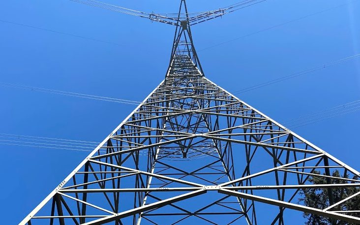
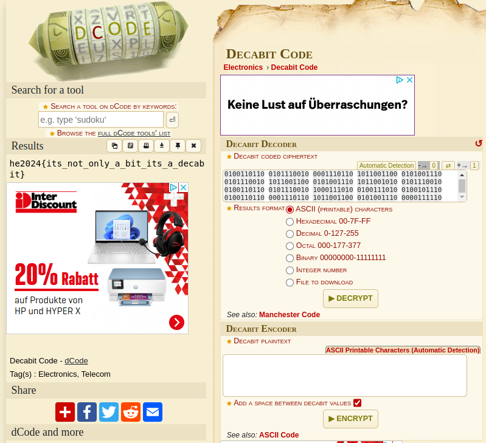

# Challenge "Power Lines"
 

**Difficulty:** ⚖️ medium | **Category:** ⚄ misc

Detected some fluctiations on the power line. We need to check it out.

    🔺🔺🔻🔺🔺🔻🔻🔺🔻🔻 🔻🔺🔻🔻🔺🔺🔺🔻🔺🔻 🔺🔺🔺🔺🔻🔻🔻🔻🔺🔻 🔺🔺🔻🔻🔺🔻🔻🔺🔺🔻 🔺🔺🔺🔺🔻🔻🔻🔻🔺🔻 🔺🔻🔺🔺🔺🔻🔻🔻🔺🔻 🔻🔻🔺🔺🔺🔺🔺🔻🔻🔻 🔺🔻🔺🔺🔻🔻🔺🔺🔻🔻 🔻🔺🔻🔺🔻🔻🔺🔺🔺🔻 🔺🔻🔺🔺🔻🔻🔺🔻🔺🔻 🔻🔺🔻🔺🔺🔺🔻🔻🔺🔻 🔺🔺🔺🔻🔺🔻🔻🔻🔺🔻 🔺🔺🔺🔻🔺🔻🔻🔺🔻🔻 🔻🔺🔻🔺🔻🔻🔺🔺🔺🔻 🔻🔺🔻🔺🔺🔺🔻🔻🔺🔻 🔺🔺🔺🔻🔺🔻🔻🔺🔻🔻 🔺🔺🔺🔻🔺🔻🔻🔻🔺🔻 🔺🔺🔻🔻🔻🔺🔻🔺🔺🔻 🔺🔺🔺🔺🔺🔻🔻🔻🔻🔻 🔻🔺🔻🔺🔺🔺🔻🔻🔺🔻 🔻🔺🔻🔻🔺🔺🔻🔺🔺🔻 🔻🔺🔻🔺🔺🔺🔻🔻🔺🔻 🔻🔻🔻🔺🔺🔺🔻🔺🔺🔻 🔺🔻🔺🔺🔻🔻🔺🔺🔻🔻 🔻🔺🔻🔺🔻🔻🔺🔺🔺🔻 🔻🔺🔻🔺🔺🔺🔻🔻🔺🔻 🔺🔻🔺🔺🔻🔻🔺🔺🔻🔻 🔻🔺🔻🔺🔻🔻🔺🔺🔺🔻 🔺🔻🔺🔺🔻🔻🔺🔻🔺🔻 🔻🔺🔻🔺🔺🔺🔻🔻🔺🔻 🔻🔺🔻🔻🔺🔺🔻🔺🔺🔻 🔻🔺🔻🔺🔺🔺🔻🔻🔺🔻 🔺🔻🔻🔻🔺🔺🔺🔻🔺🔻 🔻🔺🔻🔻🔺🔺🔺🔻🔺🔻 🔻🔺🔻🔻🔺🔻🔺🔺🔺🔻 🔻🔺🔻🔻🔺🔺🔻🔺🔺🔻 🔻🔻🔻🔺🔺🔺🔻🔺🔺🔻 🔺🔻🔺🔺🔻🔻🔺🔺🔻🔻 🔻🔺🔻🔺🔻🔻🔺🔺🔺🔻 🔻🔻🔻🔻🔺🔺🔺🔺🔺🔻

# Solution
This looks like a binary based cipher. After some cipher research, I came accross the "Decabit Decoder" and an online tool to decode it: https://www.dcode.fr/decabit-code

Google Search: power lines cipher binary

After replacing 🔺 with 1 and 🔻 with 0, I could decipher it easly:

## The Flag 🚩
    he2024{its_not_only_a_bit_its_a_decabit}
