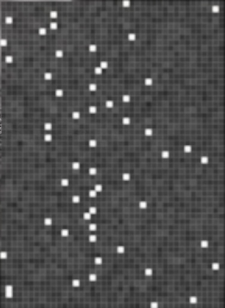
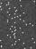

# Challenge "Ants in my Telly"
 

**Difficulty:** ☢️ hard | **Category:** ⚄ misc ; 🔍 forensics

Tired of fuzzy, soft, nice things, the bunnies are watching a nature video about spiders and ants.

But what's that?

<video controls src="ants_in_my_telly.mp4" title="Title"></video>

# Solution
## Getting the relevant parts from the video
I used for editing the video initially https://ezgif.com :
- For croping to the pixeled area: https://ezgif.com/crop-video/
- For cutting to the correct length of the pixeled area: https://ezgif.com/cut-video/

The output can be found in ./working_files/only_codes_from_video

<video controls src="working_files/only_codes_from_video/cutted_video.mp4" title="Title"></video>

## Transforming the cutted video to frames
With the help of ChatGPT, I could generate a method to export each frame into a single image:

    def extract_frames(video_path, output_folder):
        # Create output folder if it doesn't exist
        if not os.path.exists(output_folder):
            os.makedirs(output_folder)

        # Open the video file
        cap = cv2.VideoCapture(video_path)
        # Read the video frames
        success, frame = cap.read()
        frame_count = 0

        # Loop through frames
        while success:
            # Save frame as an image
            frame_path = os.path.join(output_folder, f"frame_{frame_count}.jpg")
            cv2.imwrite(frame_path, frame)

            # Read next frame
            success, frame = cap.read()
            frame_count += 1

        # Release the video capture object
        cap.release()
        print("Frames extracted successfully.")

## Calculate grid values
After that, I created another method with ChatGPT to calculate an avg pixel color for all pixels over all images. The result had to be exported into a new image:

    def calculate_average_image(folder_path):
        images = []
        
        # Iterate through all files in the folder
        for filename in os.listdir(folder_path):
            if filename.endswith('.jpg') or filename.endswith('.jpg'):  # Assuming images are jpg or png
                image_path = os.path.join(folder_path, filename)
                image = cv2.imread(image_path)
                if image is not None:
                    images.append(image)
        
        # Calculate average image
        if len(images) > 0:
            average_image = np.mean(images, axis=0).astype(np.uint8)
            return average_image
        else:
            print("No images found in the folder.")
            return None

With this, I could generate the following image which seems to look like a grid:

## Resize average calculated image
For making the grid detection easier, I tried to resize the video, so each grid-cell would be exaxtly one pixel big. This could be archive by using the following lines (grid width 40px, grid length 55px):

    # Open the image
    image = Image.open("average_image.jpg")
    # Resize the image to width 40 and height 55
    resized_image = image.resize((40, 55))
    # Save the resized image
    resized_image.save("average_image_resized.jpg")

## Parse grid
Now I needed a method, which translates pixel to value. Here I take 1 as clear white and 0 for not white. The method looks like that and was also created with the help of ChatGPT:

    def parse_grid_in_binary_file(image_path):
    # Open the image
    image = Image.open(image_path)
    
    # Convert image to grayscale
    gray_image = image.convert('L')
    
    # Get width and height of the image
    width, height = gray_image.size
    
    cipher = []
    # Iterate through each row of the image
    for y in range(height):
        # Get the pixel values of the current row
        row_pixels = list(gray_image.getdata())[y * width: (y + 1) * width]
        
        # Find the index of the whitest pixel (pixel with maximum value)
        white_index = row_pixels.index(max(row_pixels))
        
        # Initialize a list to store the binary values
        binary_values = []
        
        # Iterate through each pixel in the row
        for x, pixel_value in enumerate(row_pixels):
            # Append '0' if the pixel is not the whitest, otherwise append '1'
            binary_values.append('1' if x == white_index else '0')
        
        # Write the binary values of the row to the text file
        cipher.append(''.join(binary_values))
    return cipher

Output:

    0000000000000000000000100000000000000000
    0000000000000000000000000000000000000010
    0000000001000000000000000000000000000000
    0100000000000000000000000000000000000000
    0000000001000000000000000000000000000000
    0000000100000000000000000000000000000000
    0000000000000000000000010000000000000000
    1000000000000000000000000000000000000000
    0000000000000000100000000000000000000000
    0000000000100000000000000000000000000000
    0100000000000000000000000000000000000000
    0000000000000000001000000000000000000000
    0000000000000000010000000000000000000000
    0000000010000000000000000000000000000000
    0000000000000000000000000010000000000000
    0000000000000000100000000000000000000000
    0000000000100000000000000000000000000000
    0000000000000000000000100000000000000000
    0000000000000000000100000000000000000000
    0000000000000000100000000000000000000000
    0000000000000100000000000000000000000000
    0000000000000000000000100000000000000000
    0000000010000000000000000000000000000000
    0000000000000000000000000010000000000000
    0000000010000000000000000000000000000000
    0000000000000000100000000000000000000000
    0000000000000000000000000000000001000000
    0000000000000000000000000000010000000000
    0000000000000000000000000000000000001000
    0000000000000100000000000000000000000000
    0000000000000000100000000000000000000000
    0000000000000000000000100000000000000000
    0000000000010000000000000000000000000000
    0000000000000000010000000000000000000000
    0000000000000000100000000000000000000000
    0000000000000100000000000000000000000000
    0000000000000000000000000100000000000000
    0000000000000000100000000000000000000000
    0000000000000001000000000000000000000000
    0000000010000000000000000000000000000000
    0000000000000000100000000000000000000000
    0000000000010000000000000000000000000000
    0000000000000000100000000000000000000000
    0000000000000000000000000000000000001000
    0000000000000000000001000000000000000000
    1000000000000000000000000000000000000000
    0000000000000000010000000000000000000000
    0000000000000000000000000000000000000010
    0000000000000000000000000010000000000000
    0000000000000000100000000000000000000000
    0000000000000100000000000000000000000000
    0100000000000000000000000000000000000000
    0100000000000000000000000000000000000000
    0000000000000000000000000000000000100000
    0000000000000000000000000001000000000000

## Decrypting cipher
With some hints from Discord, I could figure out that each line could be a character and the algorithm could be a transposition cipher. Because of the flag-format he2024{...}, the first and the last entries are known.

        key = []
        for i, t in enumerate("he2024{"):
            entry = {
                "index": cipher_lines[i].index('1'),
                "value": t
            }
            if entry not in key:
                key.append(entry)
        
        key.append({
            "index": cipher_lines[len(cipher_lines)-1].index('1'),
            "value": "}"
        })  

Besides that, I also created a method for frequency analysis:

    def print_frequency_anaylsis(cipher_lines):
        frequencies = []
        for line, line_value in enumerate(cipher_lines):
            value = cipher_lines[line].index('1')
            found = False
            for index, entry in enumerate(frequencies):
                if not found:
                    if entry["value"] == value:
                        frequencies[index]["count"] = frequencies[index]["count"] + 1
                        found = True

            if not found:
                frequencies.append({
                    "value": value,
                    "count": 1
                })

        sorted_frequencies = sorted(frequencies, key=lambda d: d['count'], reverse=True)
        for entry in sorted_frequencies:
            print(entry)

Output:

    {'value': 16, 'count': 10}
    {'value': 22, 'count': 4}
    {'value': 1, 'count': 4}
    {'value': 8, 'count': 4}
    {'value': 13, 'count': 4}
    {'value': 17, 'count': 3}
    {'value': 26, 'count': 3}
    # and so on

Since we can assume that we have a quite long leet speak text, value 16 is probably an underscore. So by using these known facts, we can already know that the final flag might look like the following (- is unknown):

    he2024{-_-0----_-h-_-h---_----_h--_--_--_-_----e-_-00-}

And now I had to make a very long try and error process to test several possible keys and to try to derive from new output further keys. This was a lot of bruteforcing and in the end even required me to test some flags against the site. If it did not work, I went back to my keys and tried other combinations like changing 5 and s or O and o. This was very time consuming but in the end, those key-values could be figured out with frequency analysis and bruteforcing:

    key.append({  # Test
        "index": 0,
        "value": "1"
    })

    key.append({  # Test
        "index": 10,
        "value": "w"
    })

    key.append({  # Test
        "index": 18,
        "value": "n"
    })

    key.append({  # Test
        "index": 17,
        "value": "d"
    })

    key.append({  # Test
        "index": 8,
        "value": "3"
    })

    key.append({  # Test
        "index": 26,
        "value": "r"
    })

    key.append({  # Test
        "index": 19,
        "value": "y"
    })

    key.append({  # Test
        "index": 36,
        "value": "s"
    })

    key.append({  # Test
        "index": 21,
        "value": "p"
    })

    key.append({  # Test
        "index": 15,
        "value": "b"
    })

    key.append({  # Test
        "index": 11,
        "value": "a"
    })

    key.append({  # Test
        "index": 33,
        "value": "j"
    })

    key.append({  # Test
        "index": 29,
        "value": "u"
    })

    key.append({  # Test
        "index": 34,
        "value": "?"
    })

    key.append({  # Test
        "index": 25,
        "value": "o"
    })

By using this key against the grid, I could derive somewhen the flag.

The full code can be found here: [solver.py](solver.py)

Note: Most likely there is a way without bruteforce, but I could not find it.

## The Flag 🚩
    he2024{1_w0nd3r_why_th3r3_just_had_to_b3_a_sp1der_t00?}
