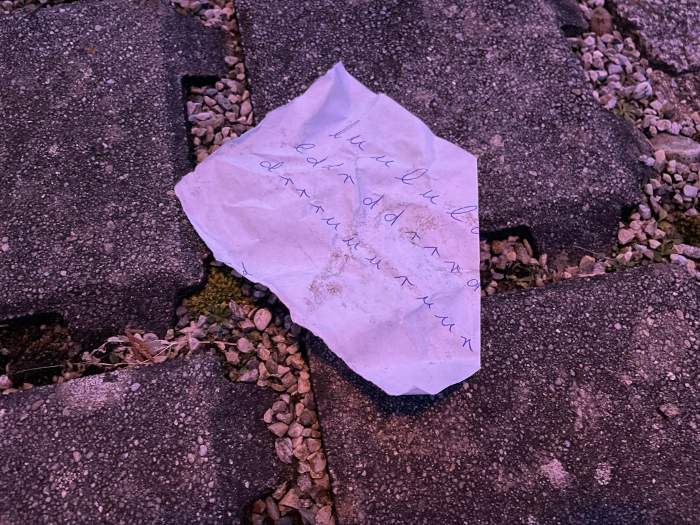

# Challenge "Hacky Easter Letters"
 

**Difficulty:** ☢️ hard | **Category:** ⚄ misc

Little rabbit Huey from the US had decided to send some Easter greeting to his friend Thumper.

He starred a long time on his keyboard and thought about how to do something nice for him.

Finally he created a cute secret message with his computer, together with a little note to decipher it.
Clumsy delivery guy dropped the note with the secret instructions in the dirt when he delivered the
greeting message. Hopefully you can help Thumper to decode it nevertheless?

[Little Rabbit's web site](http://ch.hackyeaster.com:2408/)

Hint:
If you think the dots are the most important thing, redimension your efforts and shift your focus on something else.

Be careful not to get on the wrong "paht"!

# Solution
## Initial investigation 
Based from just analysing the paper, I assumed that this is a path description. This was also somewhat implied by the challenge hint. So I assumed the following mapping from paper.jpg:

    l = left
    r = right
    u = up
    d = down

Furthermore, the rabbits name "Huey" implies that we have something like CSS HUE in use, which is needed: https://developer.mozilla.org/en-US/docs/Web/CSS/hue

Also the note of US sounds very suspicious.

Besides that, I recognized a typo here, which I assume was made by purpose:

    <path d="{path}" transform="scale(7)" stroke="black" stroke-width="Ηսе"></path> <!--TBD HERE WAS PAHT-->
    <path d="{path}" transform="Ηacky Easter ӏetters"></path> <!--TBD HERE WAS PAHT-->

## Get some working preparation
First of all, I downloaded the HTML file to my computer and removed everything except the svg with the grid of eggs:

With that HTML file, I created a script tag to code my solution directly into the site step by step. All results were logged to the console.

## Get for each egg the hue value
First and for all, I created a method for getting the hue value from a g-elements fill value (hex code):

    function getHue(hexColor) {
        let r = 0;
        let g = 0;
        let b = 0;

        if (hexColor.length === 4) {
            r = parseInt(hexColor[1] + hexColor[1], 16);
            g = parseInt(hexColor[2] + hexColor[2], 16);
            b = parseInt(hexColor[3] + hexColor[3], 16);
        } else if (hexColor.length === 7) {
            r = parseInt(hexColor.slice(1, 3), 16);
            g = parseInt(hexColor.slice(3, 5), 16);
            b = parseInt(hexColor.slice(5, 7), 16);
        }

        r /= 255;
        g /= 255;
        b /= 255;

        const cmin = Math.min(r, g, b);
        const cmax = Math.max(r, g, b);
        const delta = cmax - cmin;
        let h = 0;

        if (delta === 0) {
            h = 0;
        } else if (cmax === r) {
            h = ((g - b) / delta) % 6;
        } else if (cmax === g) {
            h = (b - r) / delta + 2;
        } else {
            h = (r - g) / delta + 4;
        }

        let hue = Math.round(h * 60);

        if (hue < 0) {
            hue += 360;
        }

        return hue;
    }
    

## Check each egg if it has dots
With another method, I could identify if a g-element has circles as childs or not:

    function containsCircle(gElement) {
        // Get all child elements of the <g> element
        const children = gElement.children;

        // Iterate over the child elements
        for (let i = 0; i < children.length; i += 1) {
            // Check if the child element is a <circle> element
            if (children[i].tagName.toLowerCase() === 'circle') {
                // If a <circle> element is found, return true
                return true;
            }
        }
        
        // If no <circle> element is found, return false
        return false;
    }

## Translate from hue and dot to US keyboard layout
After a hint from AstroViking (thanks a lot!) I knew, that the US keyboard can be mapped with the two information HUE value and dot (yes or no). The mapping from HUE is based on that cipher: https://www.dcode.fr/keyboard-coordinates (where all integers of HUE except the last character is the x coordinate and the last integer is the y coordinte ). The dot implies, if shift was pressed or not. So I could generate the following method:

    const keyboardShift = [
        ["~","!","@","#","$","%","^","&","*","(",")","_", "+","Backspace"],
        ["Tab","Q","W","E","R","T","Y","U","I","O", "P", "{", "}","|"],
        ["Caps Lock","A","S","D","F","G","H","J","K","L", ":", "\"","Enter"],
        ["Shift","Z","X","C","V","B","N","M","<",">", "?","Shift"],
        ["Ctrl","Win","Alt"," ","Alt","Win","Menu","Ctrl"],
    ];

    const keyboard = [
        ["`","1","2","3","4","5","6","7","8","9","0","-", "=","Backspace"],
        ["Tab","q","w","e","r","t","y","u","i","o", "p", "[", "]","\\"],
        ["Caps Lock","a","s","d","f","g","h","j","k","l", ";", "'","Enter"],
        ["Shfit","z","x","c","v","b","n","m",",",".", "/","Shift"],
        ["Ctrl","Win","Alt"," ","Alt","Win","Menu","Ctrl"],
    ];
    
    function getLetterFromKeycode(code, shifted=false) {
        let x = parseInt(code.toString().slice(0, -1),10) - 1;
        let y = parseInt(code.toString().slice(-1),10) - 1;

        if (shifted) {
            return keyboardShift[y][x];
        } else {
            return keyboard[y][x];
        }
    }

## Display and return a usable grid for letters instead of eggs
With all this information, I could translate the eggs to the real values in a grid.

    function displayListInGrid(lst) { // also returns grid
        // Check if the length of the list is greater than the grid size
        if (lst.length > 57 * 57) {
            console.log("List is too large to display in a 57x57 grid.");
            return null;
        }

        // Create a 57x57 grid filled with empty strings
        let grid = new Array(57).fill("").map(() => new Array(57).fill(""));

        // Fill the grid with elements from the list
        for (let i = 0; i < lst.length; i += 1) {
            let row = Math.floor(i / 57);
            let col = i % 57;
            grid[row][col] = lst[i];
        }

        // Display the grid
        for (let row of grid) {
            console.log(row.map(elem => String(elem).padEnd(3)).join(" "));
        }

        return grid;
    }

With that, the whole grid was visible:

    The egg grid translated into keyboard layout:
    j   g   d   S   n   0   A   o   L   {   9   6   $   G   t   M   H   o   {   G   K   b   N   P   T   P   A   F   M   u   b   h   C   T   H   D   S   T   W   G   p   R   G   Z   w   i   u   9   7   3   H   j   W   @   D   C   Q  
    K   8   K   b   k   Q   f   q   V   V   m   $   o   B   u   p   !   O   B   K   C   Win Z   3   1   D   z   r   Q   6   @   5   e   S   5   b   R   D   Q   R   K   D   e   s   g   Y   Q   !   q   {   2   n   s   9   X   8   U  
    x   Z   f   t   O   s   d   C   A   9   @   I   Q   w   U   6   A   R   I   9   C   w   {   6   x   p   F   4   F   i   e   C   f   e   c   3   Q   T   c   8   K   2   $   R   E   S   c   t   x   5   R   s   O   B   g   D   T  
    2   7   J   @   P   6   N   E   u   C   m   s   V   s   O   G   3   K   Y   0   F   2   i   Y   e   y   Z   p   U   }   P   v   n   v   p   x   Q   C   s   q   W   W   i   e   S   T   B   7   Y   g   u   2   0   !   I   5   g  
    _   J   Y   2   Z   5   0   b   @   {   F   V   H   3   a   g   y   o   D   E   h   p   l   s   G   K   2   s   x   e   3   T   s   e   8   4   y   T   d   !   x   r   v   q   C   I   u   w   _   5   1   5   j   S   p   j   R  
    W   l   z   L   w   H   h   3   j   B   y   2   J   _   8   9   Z   Z   d   s   U   $   d   V   t   q   f   F   Q   q   o   r   I   u   W   !   E   3   B   v   {   a   4   c   J   N   L   p   d   c   $   l   {   i   s   f   R  
    }   i   o   8   s   w   9   O   9   U   5   D   !   R   t   G   T   T   z   }   j   7   q   D   V   P   Y   S   @   M   c   O   V   Q   F   q   2   a   r   8   Q   0   3   y   T   0   g   }   n   z   D   i   @   U   0   @   G  
    2   r   4   7   F   N   U   j   y   o   i   R   S   C   k   6   @   b   B   T   a   R   G   @   p   O   a   p   _   V   M   w   m   Y   U   U   o   f   z   p   J   A   D   C   p   x   2   !   3   B   m   _   j   O   s   N   k  
    p   9   d   k   8   l   c   s   d   R   B   s   k   6   Y   e   G   N   S   Q   g   w   q   $   x   z   j   5   a   t   U   b   !   v   _   K   o   7   o   @   g   y   B   U   Z   1   K   q   f   Z   x   }   I   e   a   2   V  
    4   4   k   u   b   u   J   p   @   J   V   c   L   t   !   Z   7   d   A   }   i   o   o   d   v   1   u   a   b   o   L   _   5   o   0   y   }   K   H   m   l   T   w   _   @   O   b   C   o   a   !   l   H   o   m   M   y  
    H   K   g   6   d   N   _   U   R   y   N   c   J   I   e   n   H   6   y   b   x   z   i   e   o   $   x   2   C   D   V   U   {   Y   l   t   A   $   8   c   w   v   G   r   M   q   d   2   5   3   u   j   f   P   c   p   m  
    n   @   k   S   !   v   6   R   @   o   t   n   v   8   k   O   1   m   K   h   A   C   F   J   v   i   N   D   M   }   k   @   P   F   U   Z   J   J   h   w   8   P   v   V   d   1   n   i   4   n   R   b   0   w   v   J   E  
    s   D   T   g   0   C   Y   $   D   X   5   9   W   Y   z   d   O   v   V   8   X   $   t   F   4   I   F   A   l   R   B   p   J   Y   c   6   Z   g   i   8   F   z   1   t   f   6   3   w   t   X   O   P   z   i   3   9   _  
    M   o   U   q   C   Q   Q   i   s   u   Y   f   k   f   h   f   V   i   K   9   T   s   y   H   Q   l   A   6   H   Y   E   $   s   K   e   X   J   Y   K   2   3   R   n   7   v   c   2   f   _   K   P   I   I   2   {   t   !  
    $   u   v   k   r   t   K   h   @   W   }   P   i   E   U   t   l   R   k   p   S   y   3   N   h   @   6   S   P   x   j   W   R   C   Y   V   h   v   Z   m   A   x   a   Q   p   r   s   x   {   O   O   E   V   }   7   O   t  
    9   d   5   Y   t   c   L   X   E   s   H   w   c   l   Q   5   h   O   m   4   u   @   l   5   m   8   f   N   S   O   I   j   B   0   s   r   Z   c   G   W   J   I   x   8   d   q   B   Z   G   K   2   m   T   h   {   B   z  
    X   m   W   K   R   5   F   B   5   @   d   K   l   9   3   !   k   K   5   H   E   {   Y   r   M   T   u   B   p   T   Z   m   N   r   }   b   V   N   c   y   q   i   2   m   W   A   9   j   8   Z   g   c   H   f   $   s   J  
    i   c   a   $   3   Q   b   u   s   6   W   3   S   u   0   7   p   !   3   P   b   O   Z   L   t   o   e   A   V   p   c   2   @   E   {   {   K   W   6   h   $   Q   y   K   V   x   T   U   l   P   n   t   o   o   t   9   }  
    7   a   u   G   h   1   p   w   O   @   O   n   m   l   4   v   w   n   r   J   t   7   n   !   w   z   E   9   L   O   9   c   4   d   x   T   C   E   }   u   4   g   T   {   h   {   V   i   t   _   !   L   8   0   b   4   c  
    C   j   S   I   5   k   T   Z   C   r   Y   v   Y   d   j   F   T   {   X   {   i   X   S   U   e   5   c   l   3   9   5   u   h   $   _   |   C   a   d   Y   u   _   6   A   b   e   O   y   p   R   m   T   !   _   0   Z   x  
    C   $   Q   1   C   q   v   E   t   v   8   p   0   X   R   l   R   1   d   U   j   6   T   6   d   o   m   v   F   2   b   Q   i   f   J   4   g   j   P   7   w   R   1   5   D   K   e   I   W   w   C   6   4   t   m   K   x  
    L   e   z   z   7   4   z   M   Y   $   V   b   K   k   e   t   z   !   M   {   4   o   w   J   X   0   f   M   i   }   7   C   a   d   K   w   v   y   8   v   _   6   F   u   D   Z   R   M   r   r   K   W   s   G   p   4   z  
    7   3   S   N   H   J   d   0   {   @   w   h   j   w   @   8   d   3   S   H   2   0   S   _   T   Y   b   m   u   E   0   B   X   S   {   G   }   K   O   g   O   $   1   N   o   C   c   n   Y   r   5   Q   Z   s   p   w   s  
    C   N   t   p   9   t   _   A   r   L   Q   F   J   K   P   i   r   B   2   @   r   2   u   v   R   a   _   u   a   h   K   Z   o   w   W   6   I   u   V   g   g   z   W   J   Z   U   L   5   }   T   K   A   p   V   j   8   0  
    o   1   k   M   6   o   v   {   B   T   T   t   !   a   t   0   {   @   U   P   Z   e   h   b   c   q   {   B   @   Q   9   4   v   $   x   @   y   N   g   8   {   S   R   X   c   $   s   q   Z   R   _   d   t   v   1   V   _  
    4   T   }   T   7   H   !   w   H   p   _   b   L   F   7   k   o   k   Y   p   t   T   1   I   k   N   x   5   5   0   b   X   6   4   q   L   R   I   $   m   U   a   J   Q   $   z   D   D   M   z   A   s   y   3   C   L   i  
    c   F   O   u   K   !   N   B   2   y   j   D   r   t   W   F   _   l   _   O   p   g   8   h   $   }   v   t   s   9   r   G   D   U   C   p   P   $   2   5   X   r   8   G   }   q   U   9   t   J   J   F   B   1   x   2   W  
    e   k   J   O   L   l   3   $   @   R   f   g   S   p   9   a   t   n   E   4   X   x   6   I   2   f   !   }   B   M   4   $   N   g   T   K   V   I   d   G   4   7   S   z   Y   l   U   k   r   A   e   B   4   L   6   {   I  
    _   e   2   Y   O   p   9   u   s   q   P   $   {   e   c   5   j   Q   {   $   s   g   v   t   A   z   i   d   V   1   K   D   h   E   6   t   w   {   M   F   D   1   o   s   Q   h   x   C   W   B   k   H   W   _   V   w   1  
    @   I   k   4   L   G   N   5   1   a   B   C   K   L   a   2   L   {   M   T   3   r   _   D   j   b   s   T   !   H   l   m   O   X   j   }   {   V   J   6   L   o   C   s   B   O   S   N   O   $   o   0   n   S   5   T   $  
    Y   S   P   9   M   a   4   y   f   n   y   o   p   r   @   }   F   9   t   k   E   L   f   8   u   u   S   i   S   Y   4   {   D   G   D   D   1   4   k   c   c   S   V   Y   O   $   S   v   9   E   o   s   p   a   Q   4   !  
    L   r   D   F   y   s   5   !   F   H   9   S   _   I   K   s   z   y   i   M   A   @   r   0   0   a   b   {   R   6   u   q   @   A   u   6   U   R   g   5   4   T   o   S   d   N   O   0   3   }   E   r   N   e   D   o   8  
    d   k   A   N   i   v   Q   E   x   O   j   u   D   7   O   I   v   e   S   6   X   R   0   m   _   d   8   H   Q   V   2   P   L   t   d   z   m   v   9   r   t   f   b   B   8   q   c   G   f   k   L   t   $   L   S   O   }  
    3   U   z   b   M   l   n   }   F   2   B   Y   T   V   {   A   g   X   8   P   w   j   K   o   }   X   O   A   J   4   c   f   Z   5   p   E   n   Y   P   l   h   x   }   _   B   H   D   2   4   W   t   f   4   O   x   W   G  
    Z   m   O   Y   R   m   0   f   v   Z   9   Y   n   v   a   H   x   H   c   R   s   $   e   4   k   b   E   !   @   @   W   $   V   |   J   e   m   X   {   2   7   $   C   J   o   c   1   B   i   m   u   r   @   R   u   x   1  
    J   Z   c   b   f   f   s   o   e   !   a   j   N   L   b   W   B   4   b   @   L   @   B   B   u   E   J   u   N   0   P   A   G   N   k   u   K   m   4   0   t   v   y   Q   6   Z   L   m   C   Z   o   {   j   P   @   i   L  
    4   G   c   R   t   a   n   9   {   W   n   z   w   {   u   S   4   Z   K   Y   C   v   !   T   e   p   !   T   o   H   i   G   K   z   R   c   n   a   I   9   j   0   d   P   b   $   w   t   R   z   t   X   D   e   W   9   b  
    R   f   e   g   e   x   O   F   U   7   B   b   C   u   W   z   I   2   G   A   i   N   I   C   u   K   n   7   p   W   !   7   f   b   d   d   j   o   r   c   r   F   p   {   D   f   $   @   b   !   c   4   n   I   a   D   N  
    8   f   a   K   M   C   a   P   J   $   R   K   n   y   2   5   p   b   Z   @   X   C   !   s   W   9   K   q   h   e   b   G   Z   U   G   Q   9   F   S   $   7   I   M   x   u   T   q   b   k   z   a   @   y   4   K   s   0  
    k   7   k   b   8   B   H   s   D   s   B   C   M   s   P   6   7   Q   j   Q   u   B   u   7   u   R   }   8   L   I   t   b   s   Q   q   G   F   g   i   8   }   0   u   f   8   J   D   b   K   E   {   i   @   K   G   g   J  
    $   w   2   p   w   f   Z   h   f   c   u   K   G   k   X   I   _   o   N   2   b   T   S   H   L   O   0   D   C   }   U   T   |   a   !   b   8   _   h   R   $   T   H   B   M   9   C   k   v   b   C   Z   2   w   W   u   r  
    j   9   k   d   6   9   e   2   f   h   }   q   $   Q   l   n   @   _   h   G   o   $   B   O   _   4   R   i   M   J   @   P   g   m   f   U   d   F   e   S   v   F   P   R   I   2   5   p   r   a   1   W   I   I   U   C   i  
    c   R   M   r   S   C   {   g   W   w   u   b   }   9   g   L   g   E   5   i   !   H   a   3   W   L   I   0   f   Q   0   5   U   r   0   3   {   p   d   D   e   s   z   f   @   a   S   h   I   Y   h   p   l   N   m   A   v  
    V   B   r   I   H   !   l   e   n   V   z   c   H   Y   c   M   V   u   w   G   Y   y   L   9   j   O   Y   3   a   h   I   B   7   k   D   z   u   R   u   l   P   @   1   x   5   3   r   h   }   r   g   N   0   Y   N   C   K  
    3   Q   2   m   A   m   m   e   f   p   t   C   Z   C   T   G   I   h   }   T   v   $   4   j   o   x   x   c   K   Q   Z   c   u   r   j   3   I   C   8   D   D   4   d   g   2   X   A   r   q   d   m   F   o   8   l   W   m  
    c   s   y   _   T   U   M   Q   Y   Z   v   S   V   !   j   5   y   a   j   $   k   z   O   1   q   D   $   G   g   T   3   R   E   E   }   W   3   $   U   s   V   w   s   5   T   G   B   r   y   R   n   8   k   3   m   6   y  
    V   p   b   h   }   R   A   d   4   9   Z   @   H   p   6   d   J   7   g   Y   7   F   7   z   C   J   r   a   z   g   E   o   r   J   z   S   L   l   !   !   p   H   P   5   a   W   b   $   $   l   d   H   e   0   1   !   Q  
    0   h   y   a   f   C   c   g   u   l   M   u   g   f   B   N   _   M   k   P   N   l   a   e   w   F   s   w   w   5   M   9   E   H   x   G   j   b   M   p   K   {   w   x   i   t   j   e   3   1   k   f   6   E   v   E   N  
    Q   c   d   e   R   w   M   L   0   3   A   S   C   t   S   w   i   2   l   b   v   !   h   J   7   M   x   N   e   o   Z   Y   o   E   H   T   F   g   w   y   d   2   U   H   S   2   W   8   D   2   5   q   D   a   s   m   F  
    h   W   x   P   h   g   M   O   U   _   0   H   h   t   V   h   Z   6   X   8   b   s   2   Q   p   g   V   0   k   f   g   U   J   a   !   h   P   6   }   U   C   _   V   2   d   3   C   y   j   g   r   G   u   3   p   M   N  
    }   Y   W   }   e   H   z   9   3   Y   5   Z   t   d   s   H   T   1   m   S   W   F   I   J   K   U   W   r   k   F   K   U   a   N   V   s   }   6   h   c   i   x   _   L   C   w   k   o   3   k   v   b   U   s   5   3   5  
    z   f   _   M   7   7   Win c   c   _   s   f   N   X   b   p   O   W   o   b   0   K   R   T   x   1   s   9   J   p   c   h   {   {   m   !   e   L   b   O   H   O   W   t   l   F   $   G   n   S   J   F   2   @   2   U   b  
    g   L   R   s   A   }   c   E   v   M   I   g   O   e   9   4   z   5   9   {   5   z   M   K   b   K   j   B   T   S   I   q   r   s   g   R   Y   c   l   _   i   A   g   $   A   o   i   s   a   s   3   b   q   q   1   e   r  
    g   $   l   g   D   T   !   O   1   K   6   7   A   d   N   5   V   J   9   o   5   O   m   G   f   r   D   D   U   C   Y   r   x   5   L   i   G   z   c   $   7   M   Z   a   l   m   9   E   J   b   V   O   d   I   m   h   v  
    R   U   e   3   l   7   y   Z   C   i   v   y   K   d   B   L   e   U   o   j   J   z   5   k   k   7   u   O   v   r   x   t   l   V   6   w   e   6   H   h   $   1   U   Z   g   q   y   M   S   J   H   u   @   Y   X   z   k  
    B   6   h   1   Q   A   d   b   {   1   2   d   5   T   !   2   7   S   E   k   O   m   K   a   X   d   Q   d   G   x   Z   S   z   2   k   w   $   M   @   o   E   X   t   m   z   q   3   R   R   d   z   3   z   @   U   !   x  
    R   E   y   k   W   R   _   5   Z   f   k   s   I   @   V   _   c   k   b   P   v   Z   u   q   a   k   q   K   B   W   y   0   r   W   t   R   j   5   Z   O   P   D   R   s   r   h   q   m   w   8   o   h   I   X   3   x   E  

## Find all h in grid and evalute possible starts
Now I could check the grid for all h's and see, if the path based of the paper-directions lead to the flagstart "he2024{". That was archived by the following two methods (including the helper method for walking through the grid):

    const paperCode = [ // x = unknown path
        "l","u","u","l","u","l","d","x","x","x",        // After playing with the unknown letters around, I could figure out that the first line has one character less than the other two.
        "l","d","d","r","d","d","r","r","r","d","x",
        "d","r","r","r","u","u","u","r","u","u","r"
    ];
    
    // startPoint = {x = int, y = int}
    function walk(coordinate, direction){
        switch (direction) {
            case 'l':
                return {x: coordinate.x, y: coordinate.y - 1}
                break;
            case 'r':
                return {x: coordinate.x, y: coordinate.y + 1}
                break;
            case 'u':
                return {x: coordinate.x - 1, y: coordinate.y}
                break;
            default: // d
                return {x: coordinate.x + 1, y: coordinate.y}
                break;
        }
    }

    function findLetterCoordinates(grid, letter) {
        const coordinates = [];
        for (let i = 0; i < grid.length; i += 1) {
            for (let j = 0; j < grid[i].length; j += 1) {
                if (grid[i][j] === letter) {
                    coordinates.push({x: i, y: j});
                }
            }
        }
        return coordinates;
    }

    function validateStart(coordinate, startOfFlag, keyPart, grid){
        try{
            var validatedFlagStart = ""
            for (let i = 0; i < startOfFlag.length; i += 1) {
                var currentLetter = grid[coordinate.x][coordinate.y];
                validatedFlagStart += currentLetter;
                if(!startOfFlag.startsWith(validatedFlagStart)) {
                    return false;
                }
                
                coordinate = walk(coordinate, keyPart[i]);
            }

            return startOfFlag === validatedFlagStart;
        } catch (error){
            return false;
        }
    }

Using those methods correctly, I could only find one possible start coordinate for the flag: {x: 24, y: 22}

## Solve challenge with recursion
With the start coordinate in place and having the grid available, we can solve the riddle. I just started at the start and then walked in a recursive method through the grid based on the direction. When I faced an unknown direction, I went through all possible directions simulatniously. After that, I printed all possible flags ending with "}". From them "he2024{H@PpY_E4$T3r_fr0m_daubsi!}" seemed to be the flag.

For the recursion I created this method here:

    const paperCode = [ // x = unknown path
        "l","u","u","l","u","l","d","x","x","x", 
        "l","d","d","r","d","d","r","r","r","d","x",
        "d","r","r","r","u","u","u","r","u","u","r"
    ];

    function recursiveWalk(flag, coordinate, directions){              
        try{
            if(directions.length === 0){
                if(flag.endsWith("}")){
                    console.log(flag);
                }
            }

            let nextDirection = directions.shift();
            if(nextDirection !== "x"){
                coordinate = walk({x: coordinate.x, y: coordinate.y}, nextDirection.slice())
                flag += grid[coordinate.x][coordinate.y];
                recursiveWalk(flag.slice(), {x: coordinate.x, y: coordinate.y}, directions.slice());
            } else {
                // Bruteforce Unknown
                let coordinateU = walk({x: coordinate.x, y: coordinate.y}, 'u');
                let coordinateD = walk({x: coordinate.x, y: coordinate.y}, 'd');
                let coordinateL = walk({x: coordinate.x, y: coordinate.y}, 'l');
                let coordinateR = walk({x: coordinate.x, y: coordinate.y}, 'r');

                let flagU = flag + grid[coordinateU.x][coordinateU.y];
                recursiveWalk(flagU.slice(), {x: coordinateU.x, y: coordinateU.y}, directions.slice());

                let flagD = flag + grid[coordinateD.x][coordinateD.y];
                recursiveWalk(flagD.slice(), {x: coordinateD.x, y: coordinateD.y}, directions.slice());

                let flagL = flag + grid[coordinateL.x][coordinateL.y];
                recursiveWalk(flagL.slice(), {x: coordinateL.x, y: coordinateL.y}, directions.slice());

                let flagR = flag + grid[coordinateR.x][coordinateR.y];
                recursiveWalk(flagR.slice(), {x: coordinateR.x, y: coordinateR.y}, directions.slice());
            }
        } catch (error)
        {
            // ignore
        }
    }

It took me a lot of time to figure out, that the first line has one character less in paper.jpg. For a long time I only received the start of the flag correctly, but then it went to rubbish. I needed to adjust that for getting the flag.

Possible flags:

## The whole code including the result
Everything combined can be found within:

[Hacky Easter Letter Solution](<working/Hacky Easter 2024.html>)

## The Flag 🚩
    he2024{H@PpY_E4$T3r_fr0m_daubsi!}
