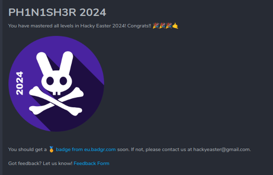

# Hacky Easter 2024 - Writeup

Welcome to my journey through Hacky Easter 2024! In this write-up, I'm excited to share my solutions for all the challenges. While I may not have the most elegant or sophisticated solutions, each one led me to the coveted flag in the end.

Big shoutout to the awesome organization team for putting together such an exciting and challenging Hacky Easter 2024 experience!

I want to extend a special thanks to the individuals credited in this write-up. Their guidance, nudges, and hints played a crucial role in unraveling some of the trickier puzzles. Without their support, this adventure would have been far more challenging.

So, join me as I delve into the depths of Hacky Easter 2024, exploring, experimenting, and ultimately triumphing in the face of each challenge. Let's dive in! 🥚🔓 Happy hacking!

CTF URL: https://www.hackyeaster.com/ 

## Credits
Acknowledgements for assistance with hints and navigating through rabbit holes: AstroViking, mdummyh, Ruthless, spire, radio, Gempana, xdjibi, c_zer0, Nemah

## Challenges

### Level 0 

| Challenge | Difficulty | Category |
|-----------|------------|--------|
| [Teaser Challenge: Encoding Baseics](<Level0-Teaser/README.md>) | 🤓 noob | ⚄ misc |

### Level 1: Welcome

| Challenge | Difficulty | Category |
|-----------|------------|--------|
| [Sanity Check](<Level1-Welcome/SanityCheck/README.md>) | 🤓 noob | ⚄ misc |

### Level 2: Noob's Paradise

| Challenge | Difficulty | Category |
|-----------|------------|--------|
| [Egg Design](<Level2-NoobsParadise/EggDesign/README.md>) | 🤓 noob | 🌐 web |
| [PEM Flag](<Level2-NoobsParadise/PEMFlag/README.md>) | 🤓 noob | ⚄ misc |
| [The Duck](<Level2-NoobsParadise/TheDuck/README.md>) | 🤓 noob | 🔐 crypto |
| [Chef's Kiss](<Level2-NoobsParadise/ChefsKiss/README.md>) | 🤓 noob | ⚄ misc |

### Level 3: Take It Easy!

| Challenge | Difficulty | Category |
|-----------|------------|--------|
| [Red Door](<Level3-TakeItEasy/RedDoor/README.md>) | 🎮 easy | 👁️ osint |
| [Weirdcode](<Level3-TakeItEasy/WeirdCode/README.md>) | 🎮 easy | < > reversing |
| [BucksBuddy](<Level3-TakeItEasy/BucksBuddy/README.md>) | 🎮 easy | 🌐 web |
| [Street Art](<Level3-TakeItEasy/StreetArt/README.md>) | 🎮 easy | 👁️ osint |
| [Monastery](<Level3-TakeItEasy/Monastery/README.md>) | 🎮 easy | 🔐 crypto |

### Level 4: Number Four

| Challenge | Difficulty | Category |
|-----------|------------|--------|
| [Piece of Cake 1](<Level4-NumberFour/PieceOfCake1/README.md>) | ⚖️ medium | ⚄ misc ; 🔐 crypto |
| [Space 64](<Level4-NumberFour/Space64/README.md>) | ⚖️ medium | 🔍 forensics |
| [Wise Rabbit 3](<Level4-NumberFour/WiseRabbit3/README.md>) | 🎮 easy | 🌐 web |
| [Prisoner](<Level4-NumberFour/Prisoners/README.md>) | 🎮 easy | 🔐 crypto |
| [Egg Buster](<Level4-NumberFour/EggBusters/README.md>) | 🎮 easy | 🌐 web |
| [Primetime](<Level4-NumberFour/Primetime/README.md>) | 🎮 easy | ⚄ misc |

### Level 5: Cinque ✋

| Challenge | Difficulty | Category |
|-----------|------------|--------|
| [Tricky Chicken](<Level5-Cinque/TrickyChicken/README.md>) | ⚖️ medium | 🌐 web |
| [Eyes Reading](<Level5-Cinque/​EyesReading/README.md>) | ⚖️ medium | ⚄ misc |
| [Planet Index](<Level5-Cinque/PlanetIndex/README.md>) | ⚖️ medium | 💀 pwn |
| [gge_deserver](<Level5-Cinque/gge_desrever/README.md>) | ⚖️ medium | ⚄ misc ; < > reversing |
| [Mr. Slapdash](<Level5-Cinque/MrSlapdash/README.md>) | 🎮 easy | 🔐 crypto |

### Level 6: Hexagon

| Challenge | Difficulty | Category |
|-----------|------------|--------|
| [Unknown Identity](<Level6-Hexagon/UnknownIdentity/README.md>) | ⚖️ medium | ☁️ cloud |
| [Hatch Latch](<Level6-Hexagon/HatchLatch/README.md>) | ⚖️ medium | < > reversing ; 🔐 crypto |
| [Zone Lockdown](<Level6-Hexagon/ZoneLockdown/README.md>) | ⚖️ medium | 💀 pwn |
| [Stenago](<Level6-Hexagon/Stenago/README.md>) | ⚖️ medium | 🔍 forensics |
| [Lost in Primes](<Level6-Hexagon/LostInPrimes/README.md>) | ⚖️ medium | ⚄ misc |

### Level 7: Seven Of Nine

| Challenge | Difficulty | Category |
|-----------|------------|--------|
| [Code³](<Level7-SevenOfNine/Code3/README.md>) | ☢️ hard | 🔐 crypto |
| [Dizzazzembly](<Level7-SevenOfNine/Dizzazzembly/README.md>) | ☢️ hard | < > reversing |
| [moduless](<Level7-SevenOfNine/moduless/README.md>) | ⚖️ medium | 🔐 crypto |
| [Power Lines](<Level7-SevenOfNine/PowerLines/README.md>) | ⚖️ medium | ⚄ misc |
| [Piece of Cake 2](<Level7-SevenOfNine/PieceOfCake2/README.md>) | ⚖️ medium | ⚄ misc ; 🔐 crypto |

### Level 8: Finale Grande

| Challenge | Difficulty | Category |
|-----------|------------|--------|
| [Yellow Door](<Level8-FinaleGrande/YellowDoor/README.md>) | ☢️ hard | 👁️ osint |
| [Hacky Easter Letter](<Level8-FinaleGrande/HackyEasterLetters/README.md>) | ☢️ hard | ⚄ misc |
| [Double Hopper](<Level8-FinaleGrande/DoubleHopper/README.md>) | ☢️ hard | 🌐 web |
| [Ants in my Telly](<Level8-FinaleGrande/AntsInMyTelly/README.md>) | ☢️ hard | ⚄ misc ; 🔍 forensics |

### Level 9

## Hacky Easter 2024 Ph1n1sh3r Badge

https://eu.badgr.com/public/assertions/iEow2z7VRL2gSW0mlcMnmg