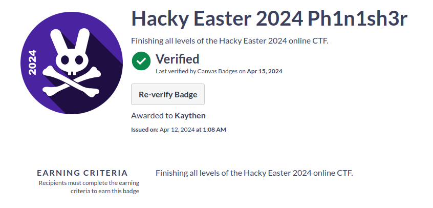

# Hacky Easter 2024 - Writeup

Welcome to my journey through Hacky Easter 2024! In this write-up, I'm excited to share my solutions for all the challenges. While I may not have the most elegant or sophisticated solutions, each one led me to the coveted flag in the end.

Big shoutout to the awesome organization team for putting together such an exciting and challenging Hacky Easter 2024 experience!

I want to extend a special thanks to the individuals credited in this write-up. Their guidance, nudges, and hints played a crucial role in unraveling some of the trickier puzzles. Without their support, this adventure would have been far more challenging.

So, join me as I delve into the depths of Hacky Easter 2024, exploring, experimenting, and ultimately triumphing in the face of each challenge. Let's dive in! 🥚🔓 Happy hacking!

CTF URL: https://www.hackyeaster.com/ 

## Credits
Acknowledgements for assistance with hints and navigating through rabbit holes: AstroViking, mdummyh, Ruthless, spire, radio, Gempana, xdjibi, c_zer0, Nemah

## Challenges

### Level 0 

| Challenge | Difficulty | Labels |
|-----------|------------|--------|
| [Teaser Challenge: Encoding Baseics](<Level 0 - Teaser/README.md>) | noob | misc |

### Level 1: Welcome

| Challenge | Difficulty | Labels |
|-----------|------------|--------|
| [Sanity Check](<Level 1 - Welcome/Sanitiy Check/README.md>) | noob | misc |

### Level 2: Noob's Paradise

| Challenge | Difficulty | Labels |
|-----------|------------|--------|
| [Egg Design](<Level 2 - Noob's Paradise/Egg Design/README.md>) | noob | web |
| [PEM Flag](<Level 2 - Noob's Paradise/PEM Flag/README.md>) | noob | misc |
| [The Duck](<Level 2 - Noob's Paradise/The Duck/README.md>) | noob | crypto |
| [Chef's Kiss](<Level 2 - Noob's Paradise/Chef's Kiss 👌/README.md>) | noob | misc |

### Level 3: Take It Easy!

| Challenge | Difficulty | Labels |
|-----------|------------|--------|
| [Red Door](<Level 3 - Take It Easy/Red Door/README.md>) | easy | osint |
| [Weirdcode](<Level 3 - Take It Easy/Weird Code/README.md>) | easy | reversing |
| [BucksBuddy](<Level 3 - Take It Easy/BucksBuddy/README.md>) | easy | web |
| [Street Art](<Level 3 - Take It Easy/Street Art/README.md>) | easy | osint |
| [Monastery](<Level 3 - Take It Easy/Monastery/README.md>) | easy | crypto |

### Level 4: Number Four

| Challenge | Difficulty | Labels |
|-----------|------------|--------|
| [Piece of Cake 1](<Level 4 - Number Four/Piece of Cake 1/README.md>) | medium | misc, crypto |
| [Space 64](<Level 4 - Number Four/Space 64/README.md>) | medium | forensic |
| [Wise Rabbit 3](<Level 4 - Number Four/Wise Rabbit 3/README.md>) | easy | web |
| [Prisoner](<Level 4 - Number Four/Prisoners/README.md>) | easy | crypto |
| [Egg Buster](<Level 4 - Number Four/Egg Busters/README.md>) | easy | web |
| [Primetime](<Level 4 - Number Four/Primetime/README.md>) | easy | misc |

### Level 5: Cinque ✋

| Challenge | Difficulty | Labels |
|-----------|------------|--------|
| [Tricky Chicken](<Level 5 - Cinque ✋/Tricky Chicken/README.md>) | medium | web |
| [Eyes Reading](<Level 5 - Cinque ✋/​Eyes Reading/README.md>) | medium | misc |
| [Planet Index](<Level 5 - Cinque ✋/Planet Index/README.md>) | medium | pwn |
| [gge_deserver](<Level 5 - Cinque ✋/gge_desrever/README.md>) | medium | misc, reversing |
| [Mr. Slapdash](<Level 5 - Cinque ✋/Mr. Slapdash/README.md>) | easy | crypto |

### Level 6: Hexagon

| Challenge | Difficulty | Labels |
|-----------|------------|--------|
| [Unknown Identity](<Level 6 - Hexagon/Unknown Identity/README.md>) | medium | cloud |
| [Hatch Latch](<Level 6 - Hexagon/Hatch Latch/README.md>) | medium | reverseing, crypto |
| [Zone Lockdown](<Level 6 - Hexagon/Zone Lockdown/README.md>) | medium | pwn |
| [Stenago](<Level 6 - Hexagon/Stenago/README.md>) | medium | forensics |
| [Lost in Primes](<Level 6 - Hexagon/Lost in Primes/README.md>) | medium | misc |

### Level 7: Seven Of Nine

| Challenge | Difficulty | Labels |
|-----------|------------|--------|
| [Code³](<Level 7 - Seven Of Nine/Code³/README.md>) | hard | crypto |
| [Dizzazzembly](<Level 7 - Seven Of Nine/Dizzazzembly/README.md>) | hard | reversing |
| [moduless](<Level 7 - Seven Of Nine/moduless/README.md>) | medium | crypto |
| [Power Lines](<Level 7 - Seven Of Nine/Power Lines/README.md>) | medium | misc |
| [Piece of Cake 2](<Level 7 - Seven Of Nine/Piece of Cake 2/README.md>) | medium | misc, crypto |

### Level 8: Finale Grande

| Challenge | Difficulty | Labels |
|-----------|------------|--------|
| [Yellow Door](<Level 8 - Finale Grande/Yellow Door/README.md>) | hard | osint |
| [Hacky Easter Letter](<Level 8 - Finale Grande/Hacky Easter Letters/README.md>) | hard | misc |
| [Double Hopper](<Level 8 - Finale Grande/Double Hopper/README.md>) | hard | web |
| [Ants in my Telly](<Level 8 - Finale Grande/Ants in my Telly/README.md>) | hard | misc, forensics |

### Level 9

## Hacky Easter 2024 Ph1n1sh3r Badge

https://eu.badgr.com/public/assertions/iEow2z7VRL2gSW0mlcMnmg